# Predicting 30-Day Hospital Readmission in Diabetic Inpatients with Deep Neural Networks

### Deep neural networks on the Diabetes 130-US-Hospitals benchmark, under an honest evaluation protocol

**Ivans Novikovs** · 2026 · [github.com/baranlanka/diabetes-readmission-dl](https://github.com/baranlanka/diabetes-readmission-dl)

---

## 1. Introduction

This report documents an end-to-end deep learning project on the Diabetes 130-US Hospitals for Years 1999–2008 dataset (Clore et al., 2014), a public record of 101,766 diabetic inpatient encounters. The predictive task is binary: given a single inpatient encounter, will the patient be readmitted within 30 days of discharge?

The project sets out to match or beat the published baselines for this task under an evaluation protocol that can be shown to be sound, rather than to maximise a headline figure. That framing matters, because the published literature on this dataset does not agree with itself: reported ROC-AUC spans 0.48 to 0.974, a twofold range on identical data that cannot reflect real differences in modelling skill. Section 2 shows the spread to be a measurement artefact and identifies the methodological variable behind it. Section 4.4 reproduces the artefact under controlled conditions and separates it into its two constituent errors.

Against that background the relevant benchmarks are as follows. LACE, the risk score hospitals currently deploy for this task, scores 0.56 here (Mingle, 2017). Carefully evaluated gradient-boosting models reach 0.63 to 0.70 and carefully evaluated neural networks 0.58 to 0.61 (Liu et al., 2024; Emi-Johnson & Nkrumah, 2025; Salim & Ibrahim, 2026). The final model in this study reaches ROC-AUC 0.665, PR-AUC 0.220 and minority-class F1 0.275, placing it above the published neural-network range, above the deployed clinical score and inside the gradient-boosting band. Every figure reported here was produced under a patient-grouped split, with all resampling and all fitted transformations confined to the training partition.

Two deep architectures are built, tuned and compared: a Dense deep neural network and a one-dimensional convolutional neural network. A logistic regression baseline is carried throughout as a control.

Several of the more useful findings here are negative ones. Hyperparameter tuning made both models slightly worse on the test set, the ensemble gains almost nothing, the two architectures are statistically indistinguishable, and deep learning barely beats logistic regression. Each is well evidenced, and on a dataset of this kind a negative result carries more information than an overstated positive one.

---

## 2. Dataset and Algorithm Selection

### 2.1 Introduction

This section justifies three choices: the dataset, the two neural network architectures, and the architecture that was deliberately *excluded*. It then presents a literature review of prior work on the same problem, structured so that its comparison table can be reused directly for the peer comparison in Section 7. The review is not a summary of what has been done; its purpose is to establish what a trustworthy result on this dataset actually looks like, because that number is the target the rest of the project is built to hit.

### 2.2 Method and justification

#### 2.2.1 Dataset selection criteria

Candidate datasets were assessed against five criteria:

| Criterion | Requirement | How Diabetes 130-US Hospitals satisfies it |
|---|---|---|
| **Scale** | "medium or large-scale secondary dataset" | 101,766 rows × 50 columns — large enough that a deep network has something to learn, small enough that the full pipeline, including five seeded repeats and 300 tuning trials, runs on a single workstation |
| **Openness** | "publicly available open data resources" | UCI Machine Learning Repository, dataset 296, **CC BY 4.0**, a single HTTP download of 3.17 MB (19.2 MB uncompressed) with no login, licence request or data-use agreement |
| Analytical substance | enough data-quality problems to make exploratory analysis worthwhile | Ten distinct classes of defect are present and measurable, two of them invisible to the standard detection idiom |
| Architectural fit | must suit two predictive neural network algorithms | Structured, tabular, mixed numeric and categorical with a binary target: the modality for which feed-forward networks and one-dimensional convolutions are both standard choices |
| Comparable prior work | results published by others on the same problem | Continuously studied since 2014; 29 verifiable references were assembled, 14 of them reporting results on this exact dataset |

The last criterion decided the choice. Without comparable prior work there is nothing to measure a result against; and here the prior work disagrees with itself by a factor of two, which turns the comparison into a research question rather than a formality.

#### 2.2.2 What the dataset is, and what it was built for

The data were extracted from Health Facts (Cerner Corporation), a warehouse covering 130 US hospitals over 1999–2008, filtered by Strack et al. (2014) to inpatient admissions with any diabetes diagnosis, a length of stay of 1–14 days, laboratory tests performed and medications administered.

Critically, the dataset was not built for prediction. Strack et al. built it to test an epidemiological association, whether measuring HbA1c during an admission is associated with lower early readmission, and found one: 9.4% readmission when HbA1c was not measured against 8.7% when it was (p = 0.007). The feature set reflects that purpose. Its columns are administrative billing and pharmacy fields chosen to *explain* readmission after the fact, not to *anticipate* it, and that is the structural reason the achievable ceiling on this task is low.

Two consequences follow for our pipeline. First, **Strack et al. removed encounters ending in death or hospice discharge**, *"to avoid biasing our analysis"*, such an encounter cannot be followed by a readmission, so its negative label is a definitional impossibility. The UCI file is the *pre-filter* extract and still contains 2,423 of them; we remove them and cite the dataset's own authors as the authority. Second, their reported positive rate differs from ours — 9.4%/8.7% on their 69,984-encounter analysis set against 11.16% in the UCI file, so any comparison must state which population is meant.

#### 2.2.3 The critical structural property: the dataset is not one row per patient

The single most consequential property of this dataset for model evaluation is that its rows are encounters, not patients. Measured directly:

```python
# Entity-level recurrence: the dataset's rows are ENCOUNTERS, not patients.
# This is the property that makes the choice of split protocol a real decision
# rather than a formality - a naive random split will place the same person on
# both sides of the train/test boundary.
n_rows = len(data)
n_patients = data["patient_nbr"].nunique()

encounters_per_patient = data.groupby("patient_nbr").size()
n_multi_encounter_patients = (encounters_per_patient > 1).sum()
rows_from_multi_enc_patients = data["patient_nbr"].map(encounters_per_patient).gt(1).sum()

print(f"Rows (encounters): {n_rows:,}")
print(f"Unique patients: {n_patients:,}")
print(f"Patients with > 1 encounter: {n_multi_encounter_patients:,} "
 f"({n_multi_encounter_patients / n_patients * 100:.1f} % of patients)")
print(f"Rows belonging to a multi-encounter patient: {rows_from_multi_enc_patients:,} "
 f"({rows_from_multi_enc_patients / n_rows * 100:.1f} % of rows)")
print(f"Max encounters for a single patient: {encounters_per_patient.max()}")
```

```text
Rows (encounters): 101,766
Unique patients: 71,518
Patients with > 1 encounter: 16,773 (23.5 % of patients)
Rows belonging to a multi-encounter patient: 47,021 (46.2 % of rows)
Max encounters for a single patient: 40
```

Nearly half of all rows belong to someone who appears in the file more than once. This falls under the "non-independence between train and test samples" category in Kapoor and Narayanan's (2023) leakage taxonomy, and it dictates that the split must be grouped on `patient_nbr`.

#### 2.2.4 The two chosen architectures, and the one rejected

Both architectures were also chosen for their optimisation properties. Each exposes a distinct and meaningful hyperparameter space, widths and regularisation for Model A, filter counts, kernel widths and pooling for Model B, so the search in Section 5 has something real to explore; and each trains quickly enough on this data to allow 30 trials per search strategy and five seeded repeats.

Model A is a Dense deep neural network, or multilayer perceptron: a feed-forward stack of fully connected layers taking numeric and binary predictors at the input and producing a single value at the output. It is the default choice for general regression and classification on structured data, and the standard configuration for a binary target is a single output neuron with a sigmoid activation trained against cross-entropy loss. It also has the closest published peer result available: the patient-grouped MLP of Liu et al. (2024), at AUROC 0.58.

A variant, Model A2, replaces the one-hot diagnosis encoding with learned entity embeddings over the three high-cardinality ICD-9 columns (716, 748 and 789 distinct codes). The justification is Guo and Berkhahn (2016), who show entity embedding *"is especially useful for datasets with high cardinality features where other methods tend to overfit"* — the case here, where one-hot encoding would produce over 2,200 near-empty binary columns. Two richer alternatives were considered and rejected on cost/benefit grounds: Choi et al.'s (2017) GRAM, which represents a code as an attention-weighted sum of its ontology ancestors but requires the ontology graph, and Miotto et al.'s (2016) Deep Patient, whose unsupervised pre-training our single-task setting cannot exploit. GRAM's *insight* is used without its machinery, since the nine-group ICD-9 clinical collapse Strack et al. themselves applied is a hand-built version of the same hierarchical idea, and it is the baseline Model A2 is measured against.

Model B is a one-dimensional convolutional network. A `Conv1D` layer convolves over a single spatial or temporal axis, so applying it to tabular data means reshaping each row of *k* features into a length-*k* sequence with one channel. Applied to structured data this is a recognised construction, and Model B uses it at 89 features.

The choice nonetheless needs questioning rather than assuming, because a convolution carries an assumption this data does not satisfy. Convolution imposes a locality prior: it treats adjacent positions as related, and it shares one filter's parameters across every position. The 89 encoded features have no meaningful ordering. Column *j* and column *j+1* are adjacent only because of the order in which the `ColumnTransformer` emitted them, and there is no reason a kernel spanning `race_Caucasian` and `gender_Female` should transfer usefully to `number_inpatient` and `age`. Treating this as a testable hypothesis rather than a settled choice is the reason Model B is built at all; Section 6.4 gives the answer.

The obvious third candidate, a recurrent network, is deliberately excluded. Recurrent architectures are built for sequence and time-series data, and an encounter record is not sequential at row level; a per-row LSTM would amount to a feed-forward network with additional machinery and no additional information. The stronger version of the idea is a per-patient sequence model, which the recurrence described in Section 2.2.3 makes technically possible, and it is rejected on two measured grounds. First, 53.8% of all encounters come from patients who appear exactly once, so for most of the data such a model collapses to a length-one sequence. Second, Hai et al. (2022) found LSTM performance on diabetic readmission rising with the number of prior encounters and levelling off at around 30, against a cohort mean of 21; the mean here is 1.42. The longitudinal depth that makes recurrence worthwhile is simply absent.

#### 2.2.5 Literature review method

Twenty-nine references were assembled, each verified at source — full text or authoritative bibliographic record (PubMed, PMC, publisher page, arXiv PDF, DOI resolver) retrieved and the cited claim read from it. Numbers that circulate only in the secondary literature are flagged as second-hand wherever they appear, and one widely-repeated claim (a CNN reporting 99.98% accuracy on this dataset) could not be located in any repository and is not cited at all. The inclusion criterion was peer-reviewed or preprint work reporting a predictive result for 30-day readmission, on this dataset or a comparable diabetic-readmission cohort. Crucially, two extra columns were recorded for every study: its split protocol and its resampling placement. No published review of this dataset does this, and it is the variable that resolves the field's disagreement.

### 2.3 Results — the literature

#### 2.3.1 The disagreement

Reported ROC-AUC on this one dataset ranges from 0.48 (Liu et al.'s SVM-RBF, below chance) to 0.974 (Sarthak et al.'s embedding network). Sorting the studies by *when resampling was applied relative to the train/test split* organises them almost completely:

| Resampling applied… | Studies | Reported AUROC |
|---|---|---|
| Not at all, or **after** the split | Bhuvan et al. (2016), Mingle (2017), Pham et al. (2019), Shang et al. (2021), Liu et al. (2024), Emi-Johnson and Nkrumah (2025), Salim and Ibrahim (2026) | **0.48 – 0.70** |
| **Before** the split | Hammoudeh et al. (2018), Goudjerkan and Jayabalan (2019), Sarthak et al. (2020) | **0.95 – 0.974** |

The separating variable is not the architecture — the 0.974 and the 0.58 both come from a multilayer perceptron. It is not the feature engineering, nor the publication year. It is one line of code in the wrong place.

#### 2.3.2 Curated comparison table

The following table is the review's centrepiece. It carries split protocol and imbalance handling as first-class columns; rows marked are not usable as performance baselines and are retained to document the pattern, not as evidence.

| Study | Model | Split protocol | Imbalance handling | ROC-AUC | Other metrics |
|---|---|---|---|---|---|
| Mingle (2017) | **LACE index** (deployed clinical score) | 10-fold CV | — | **0.56** | the bar to beat |
| Bhuvan et al. (2016) | Neural net (MLP, 1×2 units) | random 75/25 | **none** | — | **PR-AUC 0.233** |
| Bhuvan et al. (2016) | Random Forest | random 75/25 | none | — | PR-AUC 0.242 |
| Mingle (2017) | Blended ensemble, age [30–70) | 10-fold CV | balanced classifiers | 0.70 | minority-F1 **0.3001** |
| Mingle (2017) | Elastic-Net meta-model, age [70–100) | 10-fold CV | balanced classifiers | 0.65 | minority-F1 **0.2694** |
| Chopra et al. (2017) | RNN on non-sequential data | not verified | none reported | *81.1†* | † second-hand |
| Hammoudeh et al. (2018) | **1D CNN on structured data** | 80/20 **after** SMOTE | **SMOTE before split** | **~0.95** | ~0.92 accuracy/F1 |
| Goudjerkan and Jayabalan (2019) | Multilayer perceptron | not stated | **SMOTE before split** | "close to 95%" | recall ~0.99, accuracy 0.95 |
| Pham et al. (2019) | Supervised ensemble + k-means/PCA | not verified | none | *63.51†* | sensitivity ~56%; † second-hand |
| Sarthak et al. (2020) | **DNN with ICD-9 entity embeddings** | 6-fold CV **on the SMOTE-balanced set** | **SMOTE before CV → 1:1** | **0.974 ± 0.0042** | accuracy 0.952 ± 0.0034 |
| Neto et al. (2021) | Random Forest | not stated | not stated | — | accuracy 0.898 *(no-skill = 0.888)* |
| Shang et al. (2021) | Random Forest | random 80/20 | **train set only, after split** | **0.661** | correct order |
| **Liu et al. (2024)** | **MLP** | **patient-grouped 5-fold CV** | SMOTE, training fold only | **0.58** (0.57–0.59) | F1 0.79‡ *(class-averaged)* |
| Liu et al. (2024) | LSTM | patient-grouped 5-fold | SMOTE, training fold only | **0.61** | F1 0.79‡ |
| Liu et al. (2024) | XGBoost / Logistic Regression | patient-grouped 5-fold | SMOTE, training fold only | 0.64 / 0.63 | plain LR beats the MLP |
| Zarghani (2024) | LSTM | random 70/30 | not stated | — | 97.65% accuracy — **labelled "(Training)" in the paper's own table** |
| **Emi-Johnson and Nkrumah (2025)** | **Deep Neural Network** | 80/20 stratified | **class weighting** (SMOTE declined) | **0.579** | recall 0.143, precision 0.186 |
| Emi-Johnson and Nkrumah (2025) | XGBoost / LR / RF | 80/20 stratified | class weighting | **0.667** / 0.642 / 0.630 | DNN placed **last** of four |
| **Salim and Ibrahim (2026)** | **XGBoost (calibrated)** | nested 5×3 CV; **no patient grouping — authors flag it** | **no SMOTE**; cost-sensitive weights | **0.664** | **PR-AUC 0.215**, minority-F1 **0.27**, Brier 0.094 |
| Salim and Ibrahim (2026) | Stacking / LightGBM / LR / RF | as above | as above | 0.665 / 0.660 / 0.657 / 0.650 | all five within 0.015 |
| Rajkomar et al. (2018) | LSTM + attention ensemble, **full FHIR record** | held-out, per site | — | **0.75–0.76** | different cohort, 216,221 admissions |
| Hai et al. (2022) | **LSTM**, ≤80 prior encounters | 70/10/20 patient-grouped | — | **0.79 ± 0.001** | **not this dataset** — Temple Univ. cohort, 24.9% readmission |
| Hai et al. (2022) | MLP (same cohort) | patient-grouped | — | 0.69 ± 0.006 | the MLP↔LSTM gap comes from longitudinal depth |
| Kansagara et al. (2011) | Systematic review, 26 models | various | — | c 0.55–0.83 | **only six models exceeded c = 0.70** |

‡ Liu et al.'s F1/precision/recall/accuracy columns are class-averaged and majority-dominated, not minority-class values. This is confirmed by their own Naïve Bayes row (F1 0.03, accuracy 0.12, precision 0.82, precision cannot be 0.82 at 0.12 accuracy unless it is averaged over classes). Their 0.79 is therefore not a valid comparator for a minority-class F1, a point returned to in Section 7.

#### 2.3.3 What a trustworthy result looks like

The table sorts into five clusters. The deployed clinical score (LACE) sits at 0.56; trustworthy deep models on this dataset at 0.58–0.61; trustworthy classical models at 0.63–0.70; everything that resampled before splitting at 0.92–0.97; and other cohorts with far richer longitudinal input at 0.75–0.79.

Minority-class F1 is reported by only three studies in the whole literature, because most report a class-averaged F1 or none at all. Those three are the only valid comparators:

| Study | Model | Minority-class F1 |
|---|---|---|
| Mingle (2017) | Ensemble, age [70–100) | **0.2694** |
| Mingle (2017) | Ensemble, age [30–70) | **0.3001** |
| Salim and Ibrahim (2026) | XGBoost, all ages | **0.27** |

Three independent studies, nine years apart, using different algorithms: 0.27–0.30.

### 2.4 Critical analysis

#### 2.4.1 How far the leakage argument can honestly be pushed

The correlation in Section 2.3.1 is striking, and it would be easy to overstate. Three things limit it.

It is an association across a modest number of studies, not a controlled experiment, consistent with resampling placement being the cause, but unable to establish causation on its own.

At least one counterexample exists. Sarthak et al.'s own review table lists a Random Forest (Ching-Yi Lin) reporting 94.0 with data augmentation recorded as *"No"*, sitting squarely inside the high-scoring cluster. That study's split protocol could not be established independently, so *"no overlap anywhere in the literature"* is not a claim this review can support, and it is not made.

Sarthak et al.'s table cannot serve as evidence at all, and the reason is instructive: its own footnote (*"[1] – Accuracy; [2] – area under the precision-recall curve"*) reveals that four of its ten entries are not AUROC — Chopra's 81.1, Mingle's 77.21 and Pham's 63.51 are accuracy figures, and Bhuvan's "23.02" is a PR-AUC of 0.2302 tabulated in an AUROC column. A table mixing three metrics under one heading is evidence of nothing except how easily such errors propagate.

For this reason the project does not rest its central claim on other people's tables. Section 4.4 reproduces the effect directly — same architecture, same data, same seed, varying only split protocol and resampling placement. That measurement, not this correlation, is the load-bearing evidence. Kapoor and Narayanan (2023) document the same failure across 17 scientific fields and 294 papers, and note it is not misconduct: SMOTE is conventionally described in a paper's preprocessing section and `train_test_split` in its modelling section, so writing them in narrative order silently produces the bug.

#### 2.4.2 Why the honest ceiling is low, and why that is not a failure

The defensible target for a patient-grouped, carefully evaluated model on this dataset is AUROC 0.63–0.70, PR-AUC 0.21–0.24, minority-class F1 0.27–0.30, with deep architectures historically landing at the *lower* end. Four independent structural reasons explain this:

1. **The data are administrative billing records, not clinical trajectories.** The strongest determinant of readmission — the patient's actual clinical instability at discharge — is never recorded. Rajkomar et al. (2018) reach 0.75–0.76 using the *entire raw EHR*; that ~0.10 gap is the price of the reduced representation.
2. **One encounter, no history.** Beyond three aggregate prior-utilisation counters, there is no linkage backwards in time.
3. **The outcome itself is weak-signal.** Thirty-day readmission depends heavily on post-discharge factors — social support, medication adherence, outpatient follow-up, transport — none of which appear in any inpatient record. Kansagara et al. (2011) found only six published models across the whole field exceeding c = 0.70, and described the field's discriminative ability as "poor"; Futoma et al. (2015) put it more bluntly still, noting that published readmission risk models *"often exhibit poor predictive performance and would be unsuitable for use in a clinical setting."*
4. **The data are old and truncated** — 1999–2008, length of stay capped at 1–14 days.

An AUROC near 0.66 on this dataset is therefore not a weak result but roughly the state of the art, and a meaningful improvement on the 0.56 achieved by the score hospitals currently deploy.

#### 2.4.3 An expectation stated in advance

Every carefully evaluated study on this dataset has a tree ensemble beating the neural network — Liu et al. (2024): XGBoost 0.64 > LSTM 0.61 > MLP 0.58; Emi-Johnson and Nkrumah (2025): XGBoost 0.667 > DNN 0.579; Bhuvan et al. (2016): RF 0.242 > NN 0.233 PR-AUC. This is exactly what Shwartz-Ziv and Armon (2022) and Grinsztajn et al. (2022) predict for medium-sized tabular data: neural networks are biased toward overly smooth solutions and are actively harmed by uninformative features — of which this dataset has many (two 100%-constant drug columns and thirteen more that are over 99% constant).

This study commits to two deep architectures, so this cannot change the design, but stating the expectation in advance, carrying a logistic regression control throughout, and then analysing *why* the outcome is what it is, is a stronger position than pretending deep learning ought to win. In the event, the best deep model beat logistic regression on PR-AUC by 0.0056: real, very small, and as predicted.

#### 2.4.4 The research gap this project addresses

Four gaps are visible in the reviewed work; the first three are directly actionable and are addressed by this project:

1. **No published study on this dataset has enforced a patient-grouped split *and* quantified the difference against a naive random split.** Liu et al. (2024) grouped by patient but never reported the ungrouped comparison; Salim and Ibrahim (2026) explicitly flagged the absence of grouping as future work. Running both with everything else held fixed is a cheap, novel and defensible contribution (Section 4.4).
2. **The only entity-embedding treatment of ICD-9 on this dataset has an unusable evaluation.** Re-running that architecture under a correct protocol gives the first trustworthy answer to *"does embedding ICD-9 help?"*
3. **Both published `Conv1D` results on this dataset come from pipelines with the resampling placement identified above** — Hammoudeh et al. (2018) at ~0.95 (with SMOTE documented in the data-engineering stage and the split introduced afterwards) and Tavakolian et al. (2023) at 97.2%. We do not claim to have built the first CNN on this data; the narrower and defensible claim is that ours is the first evaluated under a protocol that avoids that placement.
4. **Almost no study reports PR-AUC or a tuned decision threshold** — only Bhuvan et al. (2016) and Salim and Ibrahim (2026) — despite van den Goorbergh et al. (2022) arguing that threshold tuning is what should replace resampling entirely. Section 6.3 shows this is where the largest single gain in this project came from.

---

## 3. Exploratory Data Analysis and Data Preparation

*Source notebook: `01_eda_and_preprocessing.ipynb`.*

### 3.1 Introduction

This section examines the data to surface its quality problems, then prepares it for modelling. Two structures organise the work: a taxonomy of the eight kinds of noise that occur in structured data, which supplies the checklist of what to look for, and a timing rule governing where in the pipeline each remedy may be applied.

The timing rule is the more important of the two. The taxonomy determines what to fix; the timing rule determines when, and getting the timing wrong is the failure mode Section 2 identified behind the literature's 0.48 to 0.974 disagreement. The rule is therefore treated here as a hard constraint, and every operation is documented with the side of the split it falls on and the reason.

### 3.2 Method and justification

#### 3.2.1 EDA method

Exploratory analysis summarises the main characteristics of a dataset, largely through visual methods, and its purpose here is the last of the usual five: detecting data-quality problems and guiding preprocessing. Three complementary routes are used.

| Route | Applied in this project |
|---|---|
| Pandas inspection: `df.shape`, `df.info()`, `df.head()`, `df.describe()` | First-inspection pass; this is what exposed the first data trap (Section 3.3.1) |
| Visualisation: Matplotlib, Seaborn, Sweetviz | The notebook's 8 figures; Sweetviz supplies the automated per-column pass and pairwise association matrix (`artifacts/sweetviz_report.html`) |
| Descriptive statistics: univariate, bivariate, multivariate | Histograms and boxplots for the 8 numeric VARs (`age` is still an ordinal string bin at this stage), value counts and bar plots for the categoricals, correlation matrix and crosstabs for the bivariate pass |

#### 3.2.2 The timing rule, which governs every decision that follows

The pipeline follows a fixed order: read and understand the data, clean it, split it, preprocess it, fit and evaluate a base model, then tune and evaluate again. What decides whether a given operation belongs in the cleaning step or the preprocessing step is a single rule:

> Only perform operations before the split if they use domain knowledge or predefined rules. Operations that learn from data must happen after the split, using training data only.

The consequence of breaking the rule is well understood: normalising before splitting inflates test performance, because the model has indirectly seen information about the test distribution, and the resulting estimate does not hold on genuinely unseen data.

Applying the rule to this dataset produces the allocation below. Each row is decided by the same question: does the operation learn a statistic from the data, or not?

| Operation | Learns from data? | Placement | Justification |
|---|---|---|---|
| Re-read with `na_values='?'`; restore `"Not tested"` | No, a predefined decoding rule | Before | Domain knowledge about the file's sentinels |
| Drop `weight`, `medical_specialty`, `payer_code` (>30% missing) | Borderline, though the margin is not close: 96.9%, 49.1%, 39.6% | Before | A fixed threshold, not a learned one |
| Drop `encounter_id` (identifier) | No | Before | Domain knowledge, not data statistics |
| Drop `examide`, `citoglipton` (exactly 100% constant) | No | Before | A zero-variance column carries no information under any split, so no training statistic is used |
| Remove 2,423 expired/hospice rows | No | Before | Target-variable noise; the exclusion follows Strack et al. (2014) |
| Remove 3 `gender = 'Unknown/Invalid'` rows | No | Before | An invalid category level |
| Map `age` bins to numeric midpoints | No | Before | Basic type conversion, no statistical learning involved |
| Decode the three ID columns via `IDS_mapping.csv` | No | Before | An inconsistent representation resolved by a fixed lookup |
| Group ICD-9 codes into 9 clinical categories | No | Before | A published, fixed code-range mapping, not a learned grouping |
| Mean / mode imputation | Yes | After, train only | The statistics must come from training data alone |
| `StandardScaler` | Yes | After, train only | Uses mean, standard deviation, min and max |
| `OneHotEncoder` | Yes | After, train only | Categories are learned from the training set |
| `VarianceThreshold` (near-constant columns) | Yes | After, train only | Feature selection uses training statistics |
| `OrdinalEncoder` for the diagnosis vocabulary | Yes | After, train only | The vocabulary is a training-set statistic; unseen codes need a reserved index |
| Any resampling (SMOTE, class weights) | Yes | After, train fold only | Must not expose the test distribution. No resampling is performed at this stage at all; it is deferred to the modelling notebook so it can be applied per training fold |

The constraint as usually stated operates at row level. This dataset needs an entity-level version of the same idea.

### 3.3 Results

#### 3.3.1 First inspection, and two traps in the missing-value encoding

The dataset loads as 101,766 rows by 50 columns. Running the standard missing-value check on it returns an answer that is completely wrong:

```python
# What `df.isnull().sum()` reports on the raw file:
# almost nothing - because the '?' sentinel is a STRING, not a NaN.
print("isnull() total across the whole frame:", data.isnull().sum().sum())

# The same missingness, made visible by checking for the literal string instead.
question_mark_counts = (data == "?").sum()
question_mark_counts = question_mark_counts[question_mark_counts > 0].sort_values(ascending=False)
```

```text
isnull() total across the whole frame: 0
```

`isnull()` reports zero missing values. The true figure is 192,849 missing cells across seven columns. The dataset encodes missingness as the literal string `'?'`, which is invisible to every NaN-based tool — the detector, the imputer and the missing-value heatmap alike. The remedy is a predefined decoding rule, so it belongs before the split: re-read the file with `na_values='?'`. Only after that correction does the missing-value heatmap (Figure 1) show anything at all:

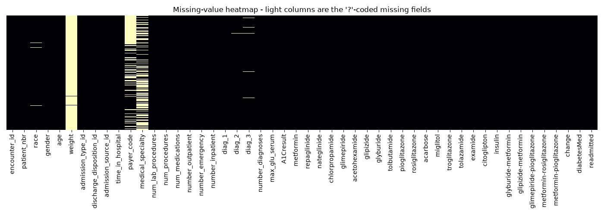

***Figure 1 — Missing-value heatmap (`weight`, `medical_specialty`, `payer_code` are the dense bands).***

That fix exposes a second, subtler trap, and this one is more consequential:

```python
# --- Second, subtler NA trap: the lab-result columns ----------------------------
# `A1Cresult` and `max_glu_serum` use the literal string "None" to mean *the test was
# not ordered*. That is a CLINICAL FACT, not a missing value - whether HbA1c was
# measured at all is the central variable of Strack et al. (2014), the study that
# created this dataset.
#
# The trap: pandas' DEFAULT na_values list already contains the string "None", and
# passing na_values="?" ADDS to that list rather than replacing it. So "None" was
# silently converted to NaN (84,748 rows of A1Cresult, 96,420 of max_glu_serum).
# Left uncorrected, the downstream most_frequent imputer would then assert a
# *measured* result for ~90% of patients who were never tested - fabricating a
# clinical finding and erasing precisely the signal the originating paper studied.
#
# Restoring the category is a domain-knowledge / predefined-rule operation that
# learns nothing from the data, so under the timing rule above it belongs BEFORE
# the train/test split.
clinical_test_cols = ["A1Cresult", "max_glu_serum"]
for col in clinical_test_cols:
 data[col] = data[col].fillna("Not tested")
```

The distinction matters clinically as much as statistically. `"Not tested"` is not an absence of information — it *is* the information. Whether a clinician ordered an HbA1c is the entire research question of the paper that created this dataset. Treating it as missing and mode-imputing it would have asserted a measured glycaemic result for roughly nine patients in ten, and would have deleted the originating study's headline variable from our feature set. After the fix:

| Column | Not tested | Norm | >7 | >8 | >200 | >300 |
|---|---|---|---|---|---|---|
| `A1Cresult` | 84,748 | 4,990 | 3,812 | 8,216 | — | — |
| `max_glu_serum` | 96,420 | 2,597 | — | — | 1,485 | 1,264 |

This single decision widened the final encoded feature matrix from 87 to 89 columns. Section 6.6 reports what the model made of it, and the answer is a negative one.

#### 3.3.2 Univariate, bivariate and target analysis

Univariate (Figure 2). Histograms and boxplots of the numeric VARs show two distinct families: four roughly symmetric measurement-like variables (`time_in_hospital`, `num_lab_procedures`, `num_medications`, `number_diagnoses`) and four severely right-skewed count variables (`num_procedures`, `number_outpatient`, `number_emergency`, `number_inpatient`) whose modal value is zero. Categorical bar plots (in the notebook) show `race` dominated by Caucasian, `gender` near-balanced, and the medication columns overwhelmingly at a single level.

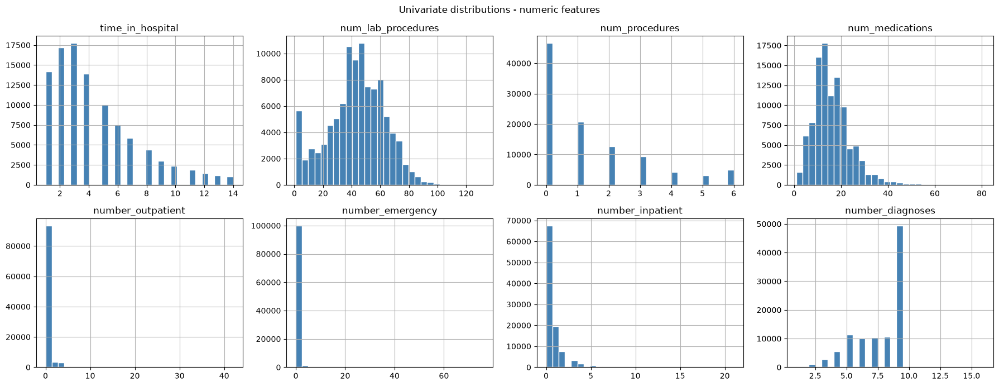

***Figure 2 — Univariate distributions of the numeric variables. Four are symmetric; four are zero-inflated counts.***

Bivariate (Figures 3–4). The correlation heatmap shows no multicollinearity requiring action: the largest off-diagonal value is 0.47 (`time_in_hospital` ↔ `num_medications`), then 0.39 (`num_procedures` ↔ `num_medications`). Correlation analysis is the standard tool for detecting redundant features; applied here it returns nothing that needs dropping.

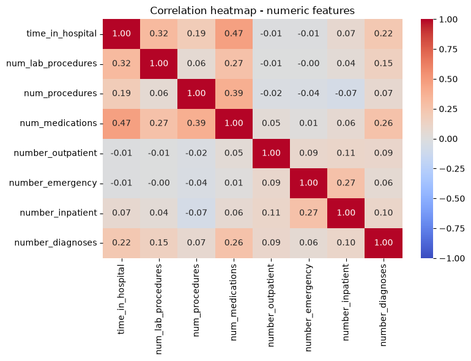

***Figure 3 — Correlation matrix, numeric VARs. No pair is redundant enough to drop.***

Boxplots split by the binary target (Figure 4) give the first hint of where the signal is. `time_in_hospital` and `num_medications` are essentially identical across the two classes; `number_inpatient` is visibly shifted, its upper quartile 2 for readmitted patients against 1 for the rest. Prior inpatient utilisation is the strongest single visual signal in the dataset, anticipating both the literature (Bhuvan et al., 2016) and the SHAP analysis in Section 6.6.

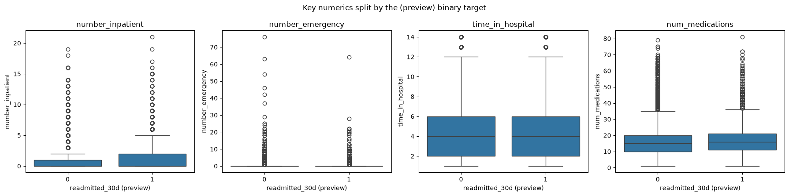

***Figure 4 — Key numeric VARs split by the target. `number_inpatient` is the only visibly discriminative variable.***

Crosstabs tell the same story for the categoricals. Row-normalised readmission rate by age band runs 1.86% ([0–10)) and 5.79% ([10–20)) at the sparse extremes, but only 9.7%–12.1% across ages 30–100, where the bulk of the data sits; admission type spans a narrower 8.4%–11.5% still. No single input variable separates the classes, which is the empirical form of the low ceiling argued in Section 2.4.2.

Target. The raw target has three levels — `NO` 54,864 (53.91%), `>30` 35,545 (34.93%), `<30` 11,357 (11.16%) — collapsed here to binary `<30` vs rest. The framing is not interchangeable with the alternatives: Bhuvan et al. (2016) show the easier "readmitted at any time" framing (~46% positive) scoring PR-AUC 0.654 against 0.233 for the `<30` task on the same data, so any comparison placing a `<30` number beside an any-time number is invalid. Section 7 keeps them separate.

#### 3.3.3 The eight classes of noise, measured

| # | Class of noise | Usual detection method | What we measured | Decision |
|---|---|---|---|---|
| 1 | Unwanted / irrelevant / redundant | metadata; Variance Threshold; correlation analysis | `encounter_id` is an identifier; `examide` and `citoglipton` are **exactly 100% constant**; 13 further drug columns are ≥99% constant; max correlation 0.47 | DROP identifier + 2 constants **before** split; VarianceThreshold **after** split |
| 2 | Duplicate values | `df.duplicated()` | **Zero** exact duplicate rows — but **47,021 rows (46.2%)** belong to a patient who appears more than once | Nothing to drop; drives the **grouped split** |
| 3 | Missing values | `isnull()`, bar chart, heatmap | **192,849** cells across 7 columns, all hidden behind `'?'`; plus the `"None"` trap (Section 3.3.1) | DROP 3 VARs >30%; impute the rest **after** split |
| 4 | Outliers | MEAN-vs-STD heuristic; IQR | Heuristic flags **4 of 8** numeric VARs | **Keep** — see below |
| 5 | Incorrect / corrupted | bar charts, histograms | `gender = 'Unknown/Invalid'` (3 rows); three nominal IDs stored as integers | REMOVE 3 rows; decode the IDs |
| 6 | Inconsistent | typo / technical errors | The `'?'` and `"None"` sentinel encodings | REPLACE via predefined rules |
| 7 | Dimensionality reduction | (listed, no method named) | 164 encoded columns after one-hot | `VarianceThreshold(0.01)` → 89 |
| 8 | **Class imbalance** (TV) | under / over / mixed sampling | **11.16%** positive; 11.39% after cleaning | **Deferred entirely** to the modelling notebook, per the Critical Rule |

Outliers need separate treatment, because the usual quick test and the correct decision point in opposite directions. The rule of thumb is that a variable has outliers when its standard deviation exceeds its mean. Applied to all eight numeric variables:

```python
# Apply the mean-versus-standard-deviation rule of thumb to every numeric feature.
mean_std_table = data[numeric_cols].agg(["mean", "std"]).T
mean_std_table["heuristic_flags_outliers"] = mean_std_table["std"] > mean_std_table["mean"]
```

```text
 mean std heuristic_flags_outliers
time_in_hospital 4.396 2.985 False
num_lab_procedures 43.096 19.674 False
num_procedures 1.340 1.706 True
num_medications 16.022 8.128 False
number_outpatient 0.369 1.267 True
number_emergency 0.198 0.930 True
number_inpatient 0.636 1.263 True
number_diagnoses 7.423 1.934 False
```

The test flags exactly four variables, and all four are counts; none of the four measurement-like variables is flagged. That pattern is itself informative. For a count with a modal value of zero and a long right tail, the standard deviation exceeds the mean by construction, so the test is picking out the distributional family rather than anomalous values. The interquartile method reaches the same place from the other direction: for `number_emergency`, Q1 and Q3 are both zero, so the interquartile range is zero and every non-zero value is nominally an outlier.

Every value is therefore kept. A patient with six emergency visits in the observation window is not a data-entry error but precisely the high-utilisation case a readmission model exists to identify, and `number_inpatient` proves to be by some margin the strongest predictor in the final model. Deleting or Winsorising these rows would have removed the signal. The skew is handled instead by standardisation after the split, which is the alternative remedy in any case.

#### 3.3.4 Cleaning, and the split

Cleaning applied nine operations, all on the "before" side of the Critical Rule, taking the data from 101,766 × 50 to 99,340 × 47.

The split is the decision this entire section builds toward. Section 3.3.3 established that 46.2% of rows belong to a recurring patient; a naive row-level split therefore leaks the same person across the train/test boundary. That is not a hypothetical — it is measured directly, before any model is trained:

```python
# A conventional random split, with stratify=y added because an 11.16 % positive
# rate would otherwise leave the partitions imbalanced against one another.
x_train_naive, x_test_naive, y_train_naive, y_test_naive = train_test_split(
 x_naive, y_naive, test_size=0.2, stratify=y_naive, random_state=RANDOM_STATE,
)

# How many test PATIENTS does the model already have training examples for?
train_patients_naive = set(x_train_naive["patient_nbr"])
test_patients_naive = set(x_test_naive["patient_nbr"])
leaked_patients_naive = train_patients_naive & test_patients_naive
n_test_rows_with_sibling = x_test_naive["patient_nbr"].isin(leaked_patients_naive).sum()
```

| Naive random split — measured leakage | Value | % of test |
|---|---|---|
| Test patients that also appear in train | **6,755** | **37.75%** |
| Test rows with a sibling encounter in train | **8,268** | **41.61%** |

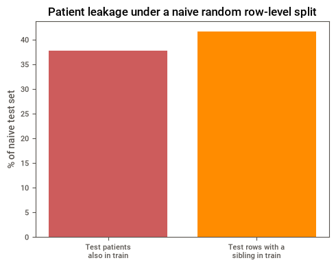

***Figure 5 — Patient leakage under a naive random row-level split, measured before any model is trained.***

Over a third of the "unseen" test patients are not unseen. This is a data-level fact requiring no model at all, and it is the reason the split used throughout this project is grouped on `patient_nbr`:

```python
# Two-stage grouped, stratified split. StratifiedGroupKFold keeps every encounter of a
# patient inside a single partition (the group constraint) while holding the 11.4 %
# positive rate steady across partitions (the stratification constraint).
# Stage 1: carve out the test fold (1/5 = 20 %).
splitter_test = StratifiedGroupKFold(n_splits=5, shuffle=True, random_state=RANDOM_STATE)
train_val_idx, test_idx = next(splitter_test.split(x_all, y_all, groups_all))

# Stage 2: split the remaining 80 % again (1/4 = 20 % of the ORIGINAL data -> validation).
splitter_val = StratifiedGroupKFold(n_splits=4, shuffle=True, random_state=RANDOM_STATE)
train_idx_local, val_idx_local = next(splitter_val.split(x_train_val, y_train_val, groups_train_val))

# The constraint is then ASSERTED, not assumed - a silent grouping failure would
# invalidate every result in this project, so it fails loudly here instead.
assert not (train_patients & val_patients), "Patient overlap between train and validation!"
assert not (train_patients & test_patients), "Patient overlap between train and test!"
assert not (val_patients & test_patients), "Patient overlap between validation and test!"
```

| Split | Rows | Patients | Positive rate |
|---|---|---|---|
| Train | 59,605 | 42,043 | 11.39% |
| Validation | 19,868 | 13,993 | 11.39% |
| Test | 19,867 | 13,951 | 11.39% |

The patient counts sum to 69,987, exactly the number of unique patients in the cleaned data, which shows the partition is both complete and disjoint. The positive rate is identical to two decimal places across all three splits, confirming that stratification survived the group constraint. A three-way rather than two-way split is necessary because the project tunes hyperparameters and selects a decision threshold; both are selection decisions, and both must be made on a partition that is neither the training data nor the final test set.

#### 3.3.5 Preprocessing after the split

Every transformation below is fitted on the training partition alone and merely applied to validation and test.

```python
# Numeric block: mean-impute the continuous variables, then standardise.
numeric_pipeline = Pipeline(steps=[
 ("imputer", SimpleImputer(strategy="mean")),
 ("scaler", StandardScaler()),
])

# Categorical block: mode-impute, then one-hot encode.
# handle_unknown="ignore" is essential under a GROUPED split: a category level that
# occurs only in held-out patients must not raise at transform time.
categorical_pipeline = Pipeline(steps=[
 ("imputer", SimpleImputer(strategy="most_frequent")),
 ("onehot", OneHotEncoder(handle_unknown="ignore", sparse_output=False)),
])

preprocessor = ColumnTransformer(transformers=[
 ("numeric", numeric_pipeline, numeric_features),
 ("categorical", categorical_pipeline, categorical_features),
])

# Fit on the TRAINING fold only...
x_train_dense = preprocessor.fit_transform(x_train_f[numeric_features + categorical_features])
#... then only TRANSFORM validation and test - they never influence the fitted statistics.
x_val_dense = preprocessor.transform(x_val_f[numeric_features + categorical_features])
x_test_dense = preprocessor.transform(x_test_f[numeric_features + categorical_features])
```

One-hot encoding produces 164 columns. `VarianceThreshold(threshold=0.01)`, also fitted on train only, then removes 75 near-constant columns, leaving the final width of 89.

The diagnosis columns get a dual representation, because the two architectures need different things from them. The 9-category clinical collapse (circulatory, respiratory, digestive, diabetes, injury, musculoskeletal, genitourinary, neoplasms, other) is one-hot encoded into the dense matrix above; separately, the raw ICD-9 code is ordinal-encoded into an integer index for Model A2's embedding layers, with one reserved index per column for codes never seen in training:

```python
for col in diag_code_features:
 n_known_categories = x_train_f[col].nunique()
 encoder = OrdinalEncoder(
 handle_unknown="use_encoded_value",
 unknown_value=n_known_categories, # one reserved index for codes unseen in training
 dtype=np.int32,
 )
 encoder.fit(x_train_f[[col]]) # vocabulary is a TRAINING statistic
```

Training vocabularies come out at 671 / 682 / 733 indices for `diag_1` / `diag_2` / `diag_3` (670, 681 and 732 codes actually observed in training, plus the reserved unknown slot each). The reserved index is not a formality: under a grouped split, held-out patients do present rare ICD-9 codes that no training patient had, and without it the encoder would raise at transform time.

### 3.4 Critical analysis

The standard taxonomy has no entry for this dataset's most dangerous defect. All eight classes of noise are present here, but the property that matters most, that 46.2% of rows belong to a patient the model may already have seen, is not one of them. Duplicate detection through `df.duplicated()` is a row-level test and returns a clean zero. Nothing in the checklist looks for repeated entities. That is less a flaw in the checklist than a consequence of a structure it was not written for: extending it to the entity level, and then measuring what the omission costs at 37.75% of test patients leaked, is what this section adds. Section 4.4 puts a figure on that leakage in AUROC.

Three decisions were taken against the obvious reading of the standard rules, each justified by a property of this dataset. Outliers were flagged and then kept, because the mean-versus-standard-deviation test assumes a roughly continuous measurement and a zero-inflated count of clinical events violates that by construction; removing the flagged values would delete the highest-utilisation patients. The fully constant and the near-constant columns were handled on opposite sides of the split, because a zero-variance column carries no information under any split whereas the question of how near is near enough at a 99% threshold is a statistic learned from data. And no resampling was performed at this stage at all, since resampling is unambiguously a learn-from-data operation, and Section 4.4 measures what applying it before the split costs.

One limitation of the `VarianceThreshold` step should be noted. The filter operates on the *encoded* matrix. When a near-constant medication column is dropped, all its one-hot levels go together, which is intended, but the same threshold also prunes individually rare levels of otherwise informative features (`race_Asian`, several rare `discharge_disposition` and `admission_source` levels). A column-by-column variance statistic cannot distinguish "this whole feature is near-constant" from "this one level is rare". We accept the trade and note the better fix: group rare levels into an explicit `'Other'` bucket before encoding, recorded as a refinement rather than implemented.

What the EDA predicted. No variable separates the classes and no correlation exceeds 0.47. Read with Section 2.4.2's structural argument, that predicted a low ceiling before a single model was trained, and Section 4.5 confirms it was right in advance, which is the strongest justification for framing success as matching the published range rather than maximising a number.

---

## 4. Model Building

*Source notebook: `02_model_building.ipynb`.*

### 4.1 Introduction

This section builds the two architectures selected in Section 2, initialises and trains them, and tests them. It also builds two controls: a variant of Model A with learned ICD-9 embeddings, and a logistic regression baseline that is carried through the whole report so that every deep result can be read against something simple.

One further step falls in this section that is not usually part of model building. Before committing to a training protocol, the alternatives were measured: a controlled 2×2 experiment over split method and resampling placement, holding architecture, data and seed fixed. Section 4.4 presents it, because it is what justifies the protocol every subsequent model uses.

### 4.2 Method and justification

#### 4.2.1 The four-stage training loop

Training a feed-forward network is a four-stage loop, and it maps onto this problem as follows:

| Stage (D08) | What it is | As applied here |
|---|---|---|
| Forward propagation | `z = W·a + b`, then `a′ = σ(z)`, repeated layer by layer | An 89-element encoded encounter vector propagates through the hidden layers to a single sigmoid unit producing P(readmission within 30 days) |
| Loss function | Measures how far a prediction sits from the true value; cross-entropy for classification | `binary_crossentropy`, the loss matching a single sigmoid output on a binary target |
| Backpropagation | *"computes gradients of the loss with respect to weights using the chain rule"*, output layer backwards to input | Handled by Keras; the gradient of the cross-entropy w.r.t. every one of Model A's 56,065 parameters |
| Gradient descent | Updates the weights and biases to minimise the loss, at a step size set by the learning rate | `optimizer="adam"`. Adam is preferred to plain SGD because it adapts a per-parameter step size, which matters on a matrix mixing standardised continuous features with sparse one-hot columns whose gradients differ in scale by orders of magnitude |

The output layer is a single neuron with a sigmoid activation, and the loss follows from it. Neither is a free parameter: both are determined by the task being binary classification.

#### 4.2.2 Training configuration, common to all three networks

Every network is trained identically, so that architecture is the only variable:

| Setting | Value | Justification |
|---|---|---|
| Optimiser | `adam` | Adaptive per-parameter step size (see above) |
| Loss | `binary_crossentropy` | Matches the binary task and the sigmoid output |
| Batch size | 256 | 233 steps per epoch over 59,605 training rows; large enough that each batch contains ~29 positive examples on average, so the gradient signal from the minority class is not lost to batch-to-batch noise |
| Max epochs | 50 | An upper bound only — never reached |
| Callback | `EarlyStopping(monitor="val_loss", patience=5, restore_best_weights=True)` | Early stopping as regularisation. `restore_best_weights=True` matters here: without it the returned model is the last epoch's, which by construction sits five epochs past the best one |
| Validation data | the validation split, **never the test split** | The test partition is used exactly once per model, at the end. It is never passed as `validation_data`, never used to select an epoch, and never used to select a threshold |
| Seed | `tf.random.set_seed(42)` before every model definition | Reproducibility; also makes the 2×2 experiment in Section 4.4 a genuine controlled comparison |

Note what is absent: no resampling, and no class weighting. The imbalance is real and is handled deliberately at the decision-threshold stage instead (Section 6.3), following van den Goorbergh et al. (2022), who found every imbalance correction they tested harmed calibration without improving discrimination. A diagnostic ablation confirmed this on our own data: retraining Model A with in-fold SMOTE cost 0.070 ROC-AUC and with `class_weight='balanced'` cost 0.030, and while both raised minority recall, neither improved discrimination — they relocate the decision boundary, which a threshold can do without touching the model.

#### 4.2.3 Model A — Dense deep neural network

```python
tf.random.set_seed(RANDOM_STATE)

classifier_a = Sequential()

# IL
# The number of neurons is equal to the number of IVs in the encoded dense matrix.
classifier_a.add(Input(shape=(n_features,)))

# HL 1
classifier_a.add(Dense(units=256, kernel_initializer="he_uniform", activation="relu"))
classifier_a.add(Dropout(0.2))

# HL 2
classifier_a.add(Dense(units=128, kernel_initializer="he_uniform", activation="relu"))
classifier_a.add(Dropout(0.2))

# OL
# Single node, sigmoid activation, since this is binary classification.
classifier_a.add(Dense(units=1, kernel_initializer="he_uniform", activation="sigmoid"))

# Compiling Neural Network
classifier_a.compile(optimizer="adam", loss="binary_crossentropy", metrics=["accuracy"])
```

Two hidden layers is the minimum depth that qualifies a network as deep, and given the low ceiling established in Section 2 there is no case for starting deeper; depth is left for the tuner in Section 5. The 256-to-128 funnel narrows toward the output so that each layer produces a more compressed set of derived features. ReLU is used on the hidden layers for its constant derivative, which avoids the vanishing gradients that saturating activations suffer from, and `he_uniform` is the initialiser designed for ReLU units, keeping activation variance stable from layer to layer. Dropout at 0.2 after each hidden layer randomly zeroes a fraction of units during training, forcing the network to spread its representation across different subsets of neurons; it is needed, since Section 4.3.1 shows Model A overfitting from epoch 5 even with it in place. The output is a single sigmoid unit.

Total parameters: 56,065. For context, Sarthak et al.'s (2020) network on this dataset used 547,279, roughly ten times as many, for a task whose ceiling is around 0.70.

#### 4.2.4 Model B — one-dimensional CNN

A convolution needs an axis to slide along, so the tabular matrix is reshaped from `(n, 89)` to `(n, 89, 1)`: 89 positions of one channel each.

```python
# The (n, k, 1) reshape that makes the tabular dense matrix Conv1D-able:
# one "channel" per row, 89 positions along the convolution axis.
x_train_cnn = x_train_dense.reshape(-1, n_features, 1)
x_val_cnn = x_val_dense.reshape(-1, n_features, 1)
x_test_cnn = x_test_dense.reshape(-1, n_features, 1)
```

```python
tf.random.set_seed(RANDOM_STATE)

model_cnn = Sequential()
model_cnn.add(Input(shape=(n_features, 1)))

# CNN layer 1 with Pooling
model_cnn.add(Conv1D(filters=64, kernel_size=2, activation="relu"))
model_cnn.add(SpatialDropout1D(0.2))
model_cnn.add(MaxPooling1D(pool_size=2))

# CNN layer 2 with Pooling
model_cnn.add(Conv1D(filters=128, kernel_size=2, activation="relu"))
model_cnn.add(SpatialDropout1D(0.2))
model_cnn.add(MaxPooling1D(pool_size=2))

# Flatten layer
model_cnn.add(Flatten())

# Fully connected Layer
model_cnn.add(Dense(128, activation="relu"))
model_cnn.add(Dropout(0.2))

# Output Layer
model_cnn.add(Dense(1, activation="sigmoid"))

# model compile
model_cnn.compile(loss="binary_crossentropy", optimizer="adam", metrics=["accuracy"])
```

The block structure is conventional for a one-dimensional convolutional classifier: `Conv1D`, spatial dropout and pooling, repeated, then flatten into a fully connected head. The layer-by-layer shape trace shows what it does to the data:

| Layer | Output shape | Parameters |
|---|---|---|
| `Conv1D(64, kernel_size=2)` | (None, 88, 64) | 192 |
| `MaxPooling1D(2)` | (None, 44, 64) | 0 |
| `Conv1D(128, kernel_size=2)` | (None, 43, 128) | 16,512 |
| `MaxPooling1D(2)` | (None, 21, 128) | 0 |
| `Flatten` | (None, 2688) | 0 |
| `Dense(128)` | (None, 128) | **344,192** |
| `Dense(1, sigmoid)` | (None, 1) | 129 |
| | | **361,025 total** |

Two features of this table follow from the locality argument in Section 2.2.4.

First, `kernel_size=2` is deliberately the smallest possible. A larger kernel would assert that a wider window of adjacent columns forms a meaningful local pattern, and since the column order is an artefact of the `ColumnTransformer`, there is no basis for that assertion. A width-2 kernel makes the weakest locality claim the layer type permits.

Second, 95% of this network's parameters (344,192 of 361,025) are in the `Dense` layer that follows the flatten, not in the convolutions, which hold only 16,704 between them. The convolutional stack is doing very little of the modelling work; most of the capacity is an ordinary fully connected layer operating on a compressed representation.

#### 4.2.5 Model A2 — Dense DNN with entity embeddings

Model A2 tests whether learned representations of the raw ICD-9 codes beat the 9-category clinical collapse. It is deliberately identical to Model A apart from the embedding path — same 256→128 funnel, same dropout, same initialiser, so any difference is attributable to the embeddings and not to a wider network:

```python
EMBEDDING_DIM = 8 # small relative to vocab size (671-733); kept modest given ~60k training rows

dense_input = Input(shape=(n_features,), name="dense_input")

diag_inputs, diag_embeddings = [], []
for diag_col in ("diag_1", "diag_2", "diag_3"):
 diag_input = Input(shape=(1,), name=f"{diag_col}_input")
 embedding = Embedding(
 input_dim=diag_vocab_sizes[diag_col], # 671 / 682 / 733, incl. the reserved unknown index
 output_dim=EMBEDDING_DIM,
 name=f"{diag_col}_embedding",
 )(diag_input)
 embedding = Flatten()(embedding)
 diag_inputs.append(diag_input)
 diag_embeddings.append(embedding)

# Concatenate the 89 dense features with the three flattened diagnosis embeddings -> 113 inputs
merged = Concatenate()([dense_input] + diag_embeddings)

# HL 1 / HL 2 - same funnel width as Model A, so any difference in results
# below is attributable to the embeddings, not to a wider/narrower network.
hidden = Dense(units=256, kernel_initializer="he_uniform", activation="relu")(merged)
hidden = Dropout(0.2)(hidden)
hidden = Dense(units=128, kernel_initializer="he_uniform", activation="relu")(hidden)
hidden = Dropout(0.2)(hidden)

output = Dense(units=1, kernel_initializer="he_uniform", activation="sigmoid")(hidden)
model_a2 = Model(inputs=[dense_input] + diag_inputs, outputs=output, name="model_a2_embeddings")
```

The `Sequential` API cannot express a multi-input graph, so this model uses the functional API. Embedding dimension 8 is a deliberate departure from the fast.ai heuristic `⌈1.6·n^0.56⌉` that Sarthak et al. (2020) used, which would give 62–65 dimensions per column here. With ~60,000 training rows and only 11.4% of them positive, three embedding tables at that width would add ~132,000 parameters devoted to rare codes; 8 dimensions gives 16,688 embedding parameters in total, a size the data can plausibly support. Total: 78,897 parameters.

#### 4.2.6 The logistic regression control

```python
logreg = LogisticRegression(max_iter=1000, random_state=RANDOM_STATE)
logreg.fit(x_train_dense, y_train)
y_proba_logreg = logreg.predict_proba(x_test_dense)[:, 1]
```

This is a control rather than one of the two deep architectures. Section 2.4.3 set out in advance the expectation that a simple model would be competitive on data of this kind, and without a baseline a figure such as 0.663 has nothing to be read against.

### 4.3 Results

#### 4.3.1 Training behaviour and fit diagnosis

Sampled iterative output. Full 50-epoch logs would be uninformative, so the first and last two epochs of Model A's run are shown (the complete `verbose=2` log is retained in the notebook):

```python
hist_df_a = pd.DataFrame(history_a.history)
hist_df_a.index.name = "epoch"
pd.concat([hist_df_a.head(2), hist_df_a.tail(2)]) # first two and last two epochs
```

```text
 accuracy loss val_accuracy val_loss
epoch
0 0.885278 0.352434 0.886501 0.340249
1 0.885865 0.341001 0.886098 0.338345
8 0.887409 0.326341 0.886149 0.338805
9 0.887157 0.323715 0.886048 0.339636
```

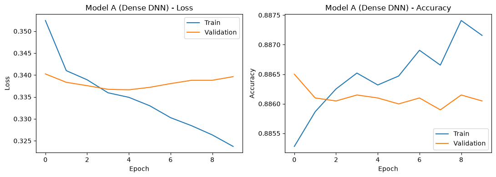

***Figure 6 — Model A (Dense DNN) learning curves. The loss panel, not the accuracy panel, carries the diagnosis.***

The loss panel carries the fit diagnosis, and it shows the classic signature: training loss falls monotonically from 0.3524 to 0.3237 while validation loss bottoms out at 0.3366 at epoch 5 and then climbs, the gap between the curves opening progressively. That is the overfitting regime, and it is why `restore_best_weights=True` matters: the model kept is the epoch-5 model, not the epoch-10 model that training ended on.

Convergence is conventionally read as the point at which the error curve flattens and stops changing. The validation curve does flatten, around epoch 4 or 5, and then reverses; the training curve never flattens inside the budget. That distinction is the whole justification for early stopping, since convergence of the training objective and convergence of generalisation are different events and the second happens first.

The accuracy panel must be read with care. It moves between 0.8853 and 0.8874, a range of 0.002, because at 11.39% prevalence accuracy is pinned near the 0.8861 majority-class baseline regardless of what the model learns. The accuracy curve is almost pure noise — the first concrete demonstration of why Section 6.2 does not use accuracy as a headline metric, and why a loss panel is plotted alongside it.

Model B behaves the same way but more slowly, running 25 epochs against Model A's 10 — its convolutional stack has 6.4× the parameters and a flatter early gradient, and reaching a best validation loss of 0.3374 at epoch 20, against Model A's 0.3366 at epoch 5. The extra capacity and the extra 15 epochs bought a marginally *worse* validation loss.

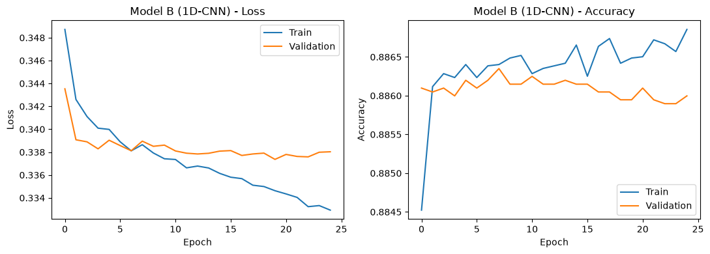

***Figure 7 — Model B (1-D CNN) learning curves.***

#### 4.3.2 Base model results

Four metrics are carried from here on, chosen for an 11.39% positive rate and fully defined in Section 6.2: PR-AUC as the headline (its baseline is the positive rate, not 0.5), ROC-AUC for literature comparability, minority-class F1 and recall for operational usefulness, and accuracy reported only beside its no-skill baseline. All four models, tested once on the held-out test partition, at the default 0.5 decision threshold:

| Model | Params | Epochs | ROC-AUC | PR-AUC | Minority F1 | Minority recall | Accuracy |
|---|---|---|---|---|---|---|---|
| Logistic Regression *(control)* | — | — | 0.6554 | 0.2141 | 0.0275 | 0.0141 | 0.8861 |
| **Model A** (Dense DNN) | 56,065 | 10 | 0.6627 | **0.2174** | 0.0079 | 0.0040 | 0.8863 |
| **Model B** (1-D CNN) | 361,025 | 25 | **0.6635** | 0.2155 | 0.0053 | 0.0027 | 0.8860 |
| Model A2 (Dense + embeddings) | 78,897 | 7 | 0.6633 | 0.2117 | 0.0087 | 0.0044 | 0.8858 |
| *No-skill baseline* | — | — | *0.5000* | *0.1139* | *0* | *0* | *0.8861* |

Four points stand out.

1. Accuracy is useless here, and this table proves it. All four models score 0.886, and so does a classifier that predicts "not readmitted" for every single encounter. The accuracy column contains no information whatsoever. Neto et al. (2021) published a "best model" on this dataset at 0.898 accuracy, one percentage point above that same no-skill baseline.

2. Minority-class F1 has collapsed to near zero — for every model. Model A's confusion matrix explains why:

```text
Model A, test set, threshold = 0.5:
[[17599 5] <- 17,604 actual non-readmissions: 17,599 correct, 5 false alarms
 [ 2254 9]] <- 2,263 actual readmissions: 2,254 missed, 9 found
```

The model identified 9 of 2,263 readmitted patients. A screening tool that misses 99.6% of the cases it exists to find is clinically worthless, and this is not a training failure — the ranking metrics show the model has learned real signal. It is a threshold failure. At 11.39% prevalence, a sigmoid trained on cross-entropy rarely emits a probability above 0.5 for any patient, so the default cut-off predicts almost all-negative. Emi-Johnson and Nkrumah (2025) report the same behaviour on this dataset, with their DNN's recall at 0.143. Section 6.3 fixes it.

3. The two required architectures are essentially tied. Model B leads ROC-AUC by 0.0008, Model A leads PR-AUC by 0.0019 — both smaller than the seed-to-seed variation reported in Section 6.4. The 1-D CNN, with 6.4× Model A's parameters and 11× its training time (67.7 s against 5.9 s), buys nothing, as the locality-prior argument predicted and the parameter distribution above already hinted.

4. Deep learning barely beats logistic regression — Model A's PR-AUC advantage over the linear control is +0.0033, which is what Shwartz-Ziv and Armon (2022) and Grinsztajn et al. (2022) predict for tabular data of this size.

#### 4.3.3 Do the ICD-9 embeddings help?

| Model | ROC-AUC | PR-AUC | Minority F1 | Accuracy |
|---|---|---|---|---|
| Model A (one-hot 9-category diagnosis collapse) | 0.6627 | **0.2174** | 0.0079 | 0.8863 |
| Model A2 (learned diagnosis embeddings) | **0.6633** | 0.2117 | 0.0087 | 0.8858 |

Not measurably. A2 is +0.0006 on ROC-AUC and −0.0057 on PR-AUC, one metric each, by margins well inside seed noise. Since Sarthak et al. (2020) is the only published entity-embedding treatment of ICD-9 on this dataset and its evaluation is unusable (Section 2.3.1), this is the first trustworthy answer to the question in the reviewed literature, and it is a negative one. Two explanations fit: the 9-category clinical collapse may already carry most of a diagnosis code's predictive content, and ~60,000 training rows over ~700 codes per column leaves many codes with too few examples to learn a useful vector. A2 also stopped earliest of the three networks, at 7 epochs with validation loss rising from epoch 2 — capacity the data could not support.

### 4.4 Validating the training protocol: the 2×2 experiment

Section 2 established that the published literature splits into a 0.48–0.70 cluster and a 0.95–0.974 cluster with resampling placement as the separating variable, and Section 2.4.1 explained why that correlation cannot carry the argument alone. This experiment settles it by measurement.

The design is a full 2×2 — {patient-grouped, naive random} × {resample inside the training fold, resample the whole pool before splitting}, with architecture, feature encoding, budget and seed identical in every cell.

The decisive addition is the primed rows. In cells (c) and (d), SMOTE balances the *entire* pool before the split, so the test partition itself becomes 50% positive, half of it synthetic. Cells (c′) and (d′) take the same trained model and re-score it on only the real test rows, restoring the true 11.4% prevalence. The difference between (c) and (c′) is therefore purely an artefact of what was measured on; the difference between (c′) and (a) is what the model actually gained from seeing synthetic neighbours of held-out rows.

| Cell | ROC-AUC | PR-AUC | Minority F1 | **Test positive rate** |
|---|---|---|---|---|
| **(a) grouped + in-fold SMOTE, the protocol used throughout** | 0.5806 | 0.1478 | 0.1700 | 11.39% |
| (b) naive + in-fold SMOTE | 0.5997 | 0.1605 | 0.1800 | 11.39% |
| **(c) naive + before-split SMOTE — as published** | **0.9554** | **0.9611** | **0.8916** | **50.00%** |
| (c′) same trained model, real test rows only | 0.7983 | 0.3563 | 0.4080 | 11.42% |
| (d) grouped + before-split SMOTE | 0.9539 | 0.9597 | 0.8876 | 50.00% |
| (d′) same trained model, real test rows only | 0.7892 | 0.3295 | 0.3787 | 10.80% |

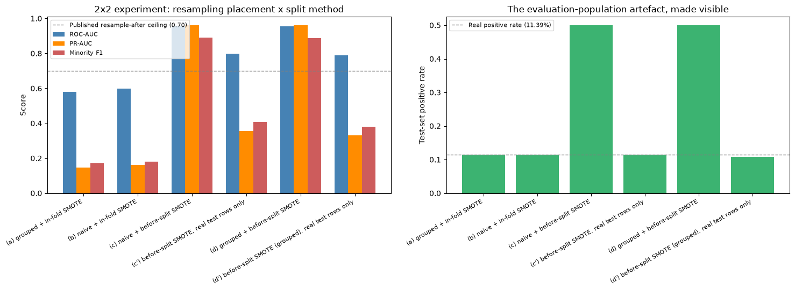

***Figure 8 — The 2×2 experiment. The right-hand panel is the whole point: cells (c) and (d) are scored on a population that does not exist.***

The total apparent inflation is +0.3748 ROC-AUC, and it decomposes into two distinct errors:

1. **Genuine train/test leakage: +0.2177** (c′ − a). Synthetic minority points interpolated from held-out rows enter the training set, and a high-capacity model memorises them. The mechanism is inherent to how SMOTE works: Chawla et al. (2002) construct each synthetic point as a convex combination of a real minority point and one of its nearest minority neighbours, so a synthetic point created before the split is literally a blend of rows that end up on both sides of it.
2. **Evaluation-population error: +0.1572** (c − c′). Resampling the whole pool balances the test set to 50% positive, so every metric reported describes a prevalence that does not exist in any hospital.

The balance between the two causes depends on which metric is being reported:

| Metric | Total gap | Leakage component | Evaluation-population component |
|---|---|---|---|
| ROC-AUC | +0.3748 | **+0.2177 (58.1%)** | +0.1572 (41.9%) |
| PR-AUC | +0.8132 | +0.2084 (25.6%) | **+0.6048 (74.4%)** |
| Minority F1 | +0.7215 | +0.2380 (33.0%) | **+0.4835 (67.0%)** |

Leakage dominates ROC-AUC, because ROC-AUC is prevalence-insensitive by construction and so absorbs the population change only indirectly. The evaluation-population artefact dominates PR-AUC and minority F1, because both are functions of precision, and precision depends directly on how many positives there are to find. Neither cause alone explains the published figures. A single-cause explanation of the 0.95+ cluster — whichever cause is chosen — accounts for at most 58% of the gap on one metric and as little as 26% on another.

Three further results from the same grid.

- **Patient grouping does not rescue whole-pool resampling.** Cells (c) and (d) are within 0.0015 of each other, and (c′) and (d′) within 0.009. Grouping constrains which *real* rows go where; SMOTE interpolates in feature space, not identity space, so a synthetic near-duplicate of a held-out patient's encounter can still land in training however the real rows were partitioned. A study that grouped by patient *and* resampled before splitting would still be inflated.
- **Capacity determines how much of the artefact is leakage.** A linear model run through the same grid shows almost no leakage inflation (+0.015), because it cannot exploit memorised interpolations; the neural network shows +0.2177. The artefact is therefore *worse* for the deep architectures that report the highest published numbers, which is consistent with the observed pattern in the literature.
- **The decomposition survived a change to the input data.** These figures were produced *after* the `A1Cresult` / `max_glu_serum` correction described in Section 3.3.1 altered the feature matrix. The pre-correction run gave +0.373 / +0.2195 / +0.1538 against the current +0.3748 / +0.2177 / +0.1572 — stable to three decimal places across materially different inputs. That is evidence the artefact is a property of the methodology, not of our particular preprocessing.

### 4.5 Critical analysis

Three independent lines of evidence converge on one conclusion: this dataset's ceiling, not the architecture, is the binding constraint. The two required architectures differ by less than a thousandth of an AUROC despite a 6.4× difference in parameter count; learned ICD-9 embeddings change nothing measurable; and a logistic regression lands within 0.0033 PR-AUC of the best deep network. A fourth follows in Section 5, where six hyperparameter searches converge within 0.004.

The question posed about Conv1D in Section 2.2.4 now has an answer. The locality prior a convolution imposes over unordered columns is not justified by the data, and the measurement agrees: Model B is statistically indistinguishable from a plain Dense network (Section 6.4: *p* = 0.3125, *d* = 0.68 over five seeds). The architecture is not *harmful*, but the convolutional machinery is inert — 95% of its weights sit in the Dense layer after the flatten. Reporting it is more useful than either quietly dropping the architecture or overstating a 0.0008 lead; and per Section 2.4.4 it is the first Conv1D result on this dataset produced under a protocol that avoids the resampling placement identified in the literature.

On what "no errors in the process" requires here. The errors that matter on this dataset are not coding errors, so three safeguards were built in, each addressing a failure documented in this dataset's own literature: the test partition is touched once per model (never `validation_data`, never the early-stopping monitor, never the source of a threshold); the grouping constraint is asserted rather than assumed (Section 3.3.4), so a silent failure raises instead of degrading quietly; and resampling, where used at all, is fitted inside the training fold — Section 4.4 measured what the alternative costs at +0.3748 ROC-AUC of non-existent performance.

The section's most important limitation is one it reports rather than hides. Every model here fails at the task it was built for: Model A finds 9 of 2,263 readmitted patients. That is a genuine failure of the *default configuration*, and it is the failure that any `.round()`-style conversion from probability to prediction walks into on an imbalanced problem. The signal exists — ROC-AUC 0.663 is above every published neural-network result on this dataset, but the operating point is wrong. Section 6.3 shows one number recovering a minority F1 of 0.276, a larger gain than the entire hyperparameter search in Section 5.

---

## 5. Model Tuning

*Source notebook: `03_hyperparameter_tuning.ipynb`.*

### 5.1 Introduction

Section 4 built both networks from hand-picked settings. This section treats those settings as what they are — hyperparameters, chosen rather than learned, and searches over them. It lists and explains each one, defines a search space, runs three different search strategies against both architectures, and reports what the search actually bought.

The short answer is: almost nothing, and for Model B slightly less than nothing. That is reported plainly, because the mechanism behind it is measurable and is a more useful result than a marginal gain would have been.

### 5.2 Method and justification

#### 5.2.1 Hyperparameter search is a zero-order search problem

Hyperparameter tuning belongs to the family of direct, or zero-order, search methods: candidate points are sampled and the objective evaluated at each, without ever using a gradient. Sampling on a regular lattice gives grid search; sampling at random gives random search, which on high-dimensional spaces often finds a better optimum for the same budget.

The reason it is the right category is straightforward. A model's parameters are optimised by gradient descent because the loss is differentiable with respect to them. Its hyperparameters are not: validation AUROC is not a differentiable function of batch size, or of which optimiser is used, so there is no gradient to descend. Zero-order search is not a fallback but the only applicable class of method.

Its known weakness frames the rest of this section:

> *"the main issue would be finding the optimal point in a large search space. Both time and accuracy may be of concern."*

Section 5.3 addresses both parts of it with measurements.

#### 5.2.2 The hyperparameters searched

| Hyperparameter | What it controls | Taught value | Searched range | Why |
|---|---|---|---|---|
| Learning rate | Step size of each gradient-descent update | 0.001 as a common default | `[0.001, 0.003, 0.01, 0.03, 0.1, 0.3]` | A standard half-decade grid spanning three orders of magnitude |
| Optimiser | The update rule itself | `adam` | `['sgd', 'adam', 'rmsprop']` | The three optimisers in common use for this kind of network |
| Batch size | Samples averaged per gradient estimate | 16 to 32 conventionally | `[64, 128, 256, 512]` | At 59,605 training rows the smaller conventional values give 1,863 to 3,725 steps per epoch, which this dataset's scale does not warrant |
| Hidden widths (Model A) | Model capacity | fixed 256 → 128 | HL1 `hp.Int(32, 256, step=32)`, HL2 `hp.Int(16, 128, step=16)` | Depth held at two hidden layers so width is the only capacity variable |
| Activation | Hidden-layer non-linearity | ReLU throughout | `['relu', 'tanh']` | The two standard alternatives for a hidden layer |
| Dropout rates | Regularisation strength | fixed 0.2 | `hp.Float(0.1, 0.5, step=0.1)` per layer | Searched independently per layer |
| Filters / kernel sizes (Model B) | Convolutional capacity and receptive field | fixed 64/128, kernel 2 | filters `hp.Int(16, 128, step=16)`, kernel `{2, 3}` per block | Lets the search test whether a wider kernel, and so a stronger locality claim, helps |
| Epochs | Passes over the training data | commonly fixed at 100 | Not searched; capped at 30 and bounded per trial by `EarlyStopping(patience=5)` | Letting early stopping choose the stopping point per configuration is better than fixing one value for all of them |

The search objective is `val_auc`, not `val_accuracy`. Section 4.3.2 showed accuracy pinned at the 0.886 majority-class baseline for every model; a search that maximised it would be optimising pure noise and could not distinguish one configuration from another. This is the same imbalance argument as before, now applied to the objective of the search itself.

```python
# The tuning objective: validation AUROC, not accuracy or loss. At 11.39%
# positive, val_accuracy is dominated by the majority-negative predictor and
# would not discriminate between hyperparameter configurations.
OBJECTIVE = kt.Objective("val_auc", direction="max")

# A standard half-decade grid over three orders of magnitude.
LR_GRID = [0.001, 0.003, 0.01, 0.03, 0.1, 0.3]
```

#### 5.2.3 Three search strategies, and how big the space really is

`RandomSearch` is plain random sampling. `BayesianOptimization` fits a surrogate model of the objective and samples where expected improvement is highest, so later trials exploit what earlier ones found. `Hyperband` gives a small epoch budget to many configurations and successively halves the field. The latter two attack the large-search-space problem from opposite directions, one by sampling more intelligently, the other by making each sample cheaper. Whether either can succeed depends on how much of the space 30 trials covers:

```python
cardinality_a = (
 n_values(32, 256, 32) * n_values(16, 128, 16) # hl1_units, hl2_units
 * n_values(0.1, 0.5, 0.1) * n_values(0.1, 0.5, 0.1) # dropout_1, dropout_2
 * len(ACTIVATION_CHOICES) * len(LR_GRID)
 * len(OPTIMIZER_CHOICES) * len(BATCH_SIZE_CHOICES)
)
```

```text
Model A (Dense) search-space cardinality: 230,400
Model B (CNN) search-space cardinality: 36,864,000

Per-strategy sampled fraction (MAX_TRIALS = 30):
 Model A: 1.30e-04 (30 / 230,400)
 Model B: 8.14e-07 (30 / 36,864,000)
```

Thirty trials samples 0.013% of Model A's space and 0.00008% of Model B's. That is the large-search-space problem quantified, and it is a fact about the arithmetic rather than about the compute budget: a hundred times more trials would still leave Model B's space essentially unexplored.

### 5.3 Results

#### 5.3.1 Six searches, one answer

| Model · Strategy | Trials | Wall-clock (s) | Trials to best | Best validation ROC-AUC |
|---|---|---|---|---|
| A · Random | 30 | **304** | 19 | 0.6654 |
| A · **Bayesian** | 30 | 399 | 25 | **0.6696** |
| A · Hyperband | 90 | 554 | 52 | 0.6677 |
| B · Random | 30 | 1,387 | 30 | 0.6656 |
| B · **Bayesian** | 30 | **1,124** | 24 | **0.6661** |
| B · Hyperband | 90 | 1,343 | 47 | 0.6660 |

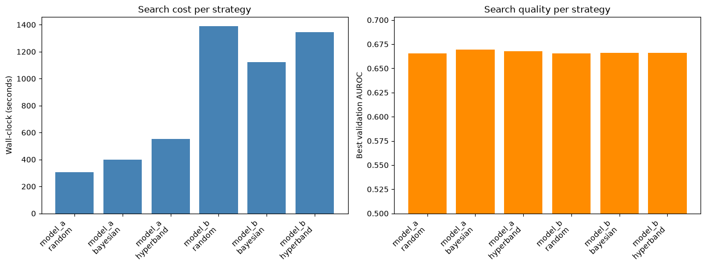

***Figure 9 — Search cost (left) against search quality (right). The right-hand panel is flat.***

All six searches converge within 0.004 validation ROC-AUC of one another. Bayesian optimisation found Model A's best score and was the *cheapest* strategy for Model B — the expected payoff from a surrogate that concentrates its trials. Hyperband ran three times as many trials for no advantage on either model: successive halving helps when configurations separate early, and on this landscape they do not separate at all. Plain random search came within 0.004 of the best for a third of Bayesian's cost on Model A. On a flat objective landscape, a more intelligent search finds the same answer, a property of the problem, not a deficiency in the methods.

#### 5.3.2 What tuning bought: nothing, then less than nothing

The winning configuration for each model was retrained with `EarlyStopping` plus `ReduceLROnPlateau`, and evaluated once on the test partition.

| Model | ROC-AUC untuned → tuned | Δ | Minority F1 untuned → tuned | Δ |
|---|---|---|---|---|
| **Model A** (Dense) | 0.6627 → 0.6635 | **+0.0008** | 0.2755 → 0.2736 | **−0.0019** |
| **Model B** (CNN) | 0.6635 → **0.6597** | **−0.0038** | 0.2815 → 0.2784 | **−0.0031** |

*(Minority F1 is measured at each model's own validation-selected threshold, so the comparison is like-for-like.)*

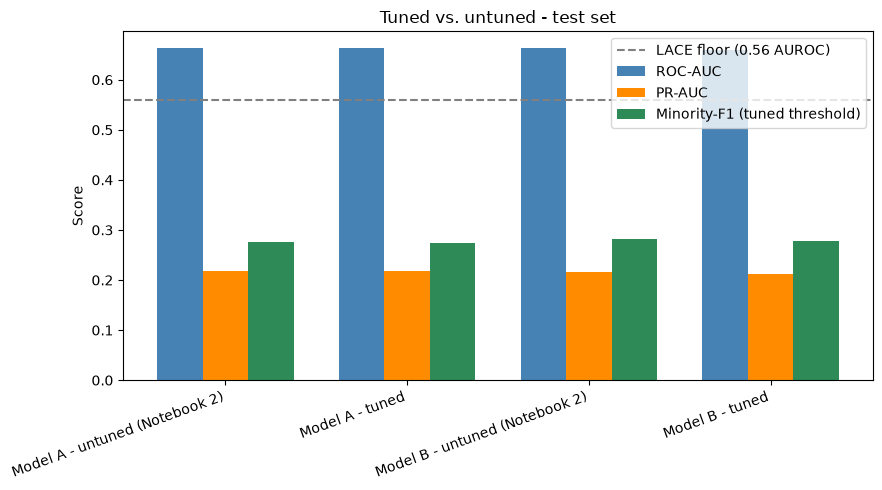

***Figure 10 — Tuned versus untuned, test set. The bars are the same height.***

Both models lost minority F1, and Model B lost on both metrics. The mechanism is straightforward: the tuned configurations won on validation — that is how they were selected, and then lost on test. With 30 trials sampling 1.3×10⁻⁴ and 8.1×10⁻⁷ of their spaces, on a landscape where all six searches land within 0.004 of each other, the differences the tuner is ranking are smaller than the validation set's own sampling noise. Validation-set selection is therefore picking noise, not signal, and noise does not transfer to a different partition.

Both halves of the warning about direct search are borne out: 1 h 25 min of compute across the six searches, 5,111 seconds in total, and accuracy that went backwards.

A secondary limitation compounds it. The search objective was `val_auc`, so the search was structurally indifferent to minority-class F1 — it had no reason to preserve a metric it was never asked to optimise, which is why that metric regressed in both models.

#### 5.3.3 A cross-check on the learning rate

The learning rate was searched twice by independent methods. The tuner chose 0.001 for both models, the smallest value in the six-value grid. A separate learning-rate range test, which sweeps the rate upward during a short run and locates the elbow where loss falls fastest before divergence, suggested roughly 1.3×10⁻⁶ for Model A and 1.2×10⁻⁴ for Model B.

Both methods point the same way: the grid's lower bound is binding. A search that selects the minimum of a bounded grid is signalling an optimum at or below the boundary, and the range test places it there independently. The grid spans 0.001 to 0.3, and on this dataset the useful region lies entirely at or beneath its floor. `ReduceLROnPlateau` compensated in part during the retrain, decaying Model A's rate from 1×10⁻³ to 5×10⁻⁴ and then 2.5×10⁻⁴ across its 23 epochs, moving toward what the range test recommended.

The winning configurations themselves:

```text
Model A: activation=tanh, hl1_units=128, dropout_1=0.2, hl2_units=64,
 dropout_2=0.4, learning_rate=0.001, optimizer=adam, batch_size=256
Model B: activation=relu, filters_1=96, kernel_1=2, spatial_dropout_1=0.3,
 filters_2=48, kernel_2=3, spatial_dropout_2=0.4, dense_units=160,
 dense_dropout=0.3, learning_rate=0.001, optimizer=rmsprop, batch_size=256
```

Both selected the same batch size and learning rate as the hand-built models, and both selected *smaller* hidden widths than the hand-picked 256→128 and 64/128 filters, consistent with a dataset whose ceiling is low enough that extra capacity has nothing to buy.

### 5.4 Critical analysis

This section measures what optimisation is actually worth in predictive modelling. Tuning pays when the objective landscape has structure to exploit; here it does not. Six searches over two architectures, three strategies and 300 trials produce a validation spread of 0.004 ROC-AUC, and the best of them transfers to test as +0.0008 on one model and −0.0038 on the other — the fourth independent line of evidence for Section 4.5's conclusion, and one Salim and Ibrahim (2026) corroborate externally with five carefully-evaluated models spanning just 0.015 AUROC on this dataset.

Three limitations qualify this. First, one seed per configuration: with a validation spread of 0.004, a single seed cannot reliably rank configurations, which is simultaneously a weakness and the finding, since the differences being ranked are smaller than the noise, and that is precisely why they did not transfer. Second, depth was held fixed at two hidden layers, so this search cannot say whether a deeper network helps; given that the tuner chose *narrower* layers than the hand-built model, extra depth is not the obvious missing ingredient, but it is untested. Third, the objective ignored the metric that matters most: `val_auc` is right for literature comparability, but the operationally important quantity is minority-class performance at a usable threshold, and the regression in minority F1 is the direct evidence for that misalignment.

The result that puts this section in proportion. Sixty trials per model, 1 h 25 min of compute and three search strategies moved minority F1 by −0.002. Changing one number — the decision threshold, Section 6.3 — moves it by +0.27. That is not an argument against tuning; it is an argument about *where the leverage lives* on an imbalanced problem.

---

## 6. Model Evaluation and Discussion

*Source notebook: `04_evaluation_and_ensemble.ipynb`.*

### 6.1 Introduction

This section selects and describes the evaluation metrics, applies them, and identifies the best predictive model. It does four things beyond a single evaluation pass: it fixes the operating-point failure that Section 4.3.2 exposed; it repeats every model over five seeds so that differences can be read against their own uncertainty; it tests whether the two architectures are different enough to be worth ensembling; and it opens the winning model up with SHAP.

### 6.2 Method — evaluation metrics, selected and described

Each metric is defined below and justified against the dataset's 11.39% positive rate, since metric choice matters more than usual at this level of imbalance.

All threshold-dependent metrics derive from the confusion matrix, which cross-tabulates predictions against truth into true positives (TP), false positives (FP), true negatives (TN) and false negatives (FN). On this task a TP is a correctly anticipated 30-day readmission and an FN is one that was missed.

| Metric | Definition | Why it is used here — or is not |
|---|---|---|
| **Accuracy** | (TP+TN) / total | **Reported only alongside its no-skill baseline.** Predicting "not readmitted" for every encounter scores **0.8861** on our test set. Any accuracy near 0.886 is therefore uninformative; Neto et al. (2021) published a "best model" at 0.898 on this dataset, one point above that floor |
| **Precision** (minority class) | TP / (TP+FP) | Of the patients the model flags, what fraction really are readmitted. This is the operational cost side — each false positive is a discharge intervention spent on someone who did not need it |
| **Recall / sensitivity** (minority class) | TP / (TP+FN) | Of the patients who *were* readmitted, what fraction the model found. This is the clinical benefit side, and it is the metric Section 4.3.2's failure destroyed |
| **F1** (minority class) | 2·(precision·recall)/(precision+recall) | The harmonic mean, which is dominated by whichever of the two is worse — so it cannot be gamed by an all-negative predictor. **It must be computed with `pos_label=1`**; the class-averaged variant is majority-dominated and would read ~0.83 for a model that finds nine patients out of 2,263 |
| **ROC-AUC** | Area under TPR against FPR over all thresholds | Threshold-free ranking quality; 0.5 is chance. Reported **primarily for literature comparability**, since it is the metric every published study quotes. Its weakness under imbalance is that FPR has the large negative class in its denominator, so a large absolute number of false positives moves it very little (Saito & Rehmsmeier, 2015) |
| **PR-AUC** (average precision) | Area under precision against recall | **Our headline metric.** Its baseline is the positive rate (0.1139), not 0.5, and precision responds directly to false positives at the operating point that matters. Saito and Rehmsmeier (2015) show by simulation that PR plots are more informative than ROC plots on imbalanced data; Bhuvan et al. (2016) reached the same conclusion independently on this exact dataset |

The decision threshold is treated as a hyperparameter, not a constant. Converting a probability to a prediction requires a cut-off, and 0.5 is a convention, not a derived value. At 11.39% prevalence a sigmoid trained on cross-entropy rarely exceeds it. The threshold is therefore selected by maximising minority-class F1 on the validation partition and then applied unchanged to test — the same discipline as every other selection decision in this project. van den Goorbergh et al. (2022) argue that this is what should replace resampling entirely, and Section 4.2.2 reports the ablation measuring the alternative.

### 6.3 The decision threshold — the largest single gain in the project

Model A (tuned), evaluated at the default cut-off and at the validation-selected one:

| Operating point | Threshold | Precision | Recall | **Minority F1** | Accuracy | ROC-AUC | PR-AUC |
|---|---|---|---|---|---|---|---|
| Default | 0.5 | 0.5714 | **0.0018** | **0.0035** | **0.8861** | 0.6635 | 0.2182 |
| Validation-selected | **0.122** | 0.2054 | **0.4096** | **0.2736** | 0.7523 | 0.6635 | 0.2182 |

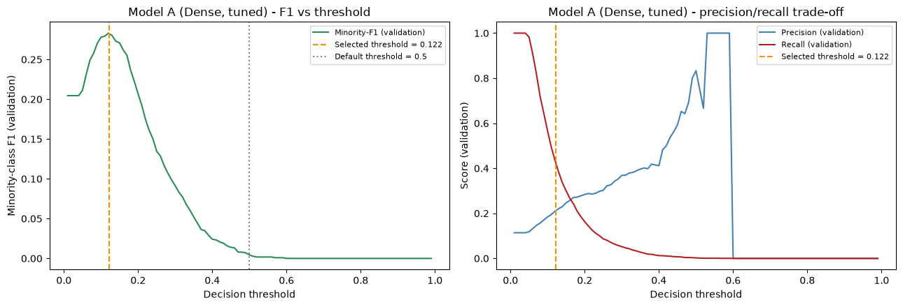

***Figure 11 — Threshold selection for Model A, computed on validation. The default 0.5 sits far to the right of the peak, in the region where recall has already collapsed.***

Minority F1 moves from 0.0035 to 0.2736, a gain of 0.270, while ROC-AUC and PR-AUC do not move at all. Since both are threshold-free, their stability confirms that the ranking quality was present throughout. Nothing was learned; a cut-off was moved. Recall rises from 0.0018 to 0.4096, taking the model from finding 4 of 2,263 readmissions to roughly 927 of them.

The cost is real and the change is a trade rather than a free gain. Accuracy falls from 0.8861 to 0.7523 and precision from 0.571 to 0.205, so four in five flagged patients are false alarms. For a discharge-planning triage tool that is the correct direction, an unnecessary follow-up call costs far less than an unanticipated readmission, and Salim and Ibrahim (2026) make the same choice, reporting their operating point at a 10% threshold with sensitivity 0.723 and PPV 0.162.

Set beside Section 5, this is the headline of the evaluation. Sixty tuning trials per model moved minority F1 by −0.002; changing one number moved it by +0.270. On an imbalanced problem the leverage is in understanding the metric and the prevalence, not in searching harder.

### 6.4 Repeated-seed results and statistical comparison

A single training run gives a single number with no indication of how much of it is the seed. Every model was therefore trained on five seeds (42, 123, 2024, 7, 31415) and is reported as mean ± half-width of a 95% confidence interval. Logistic regression uses a deterministic solver, so it has one value and no interval.

| Model | ROC-AUC | PR-AUC | Minority F1 |
|---|---|---|---|
| Logistic Regression *(deterministic, n=1)* | 0.6554 | 0.2141 | 0.2710 |
| Model A2 (Dense + embeddings) | 0.6615 ± 0.0024 | 0.2128 ± 0.0031 | 0.2734 ± 0.0034 |
| Model B (CNN, tuned) | 0.6627 ± 0.0022 | 0.2159 ± 0.0024 | **0.2781 ± 0.0022** |
| Model A (Dense, tuned) | 0.6639 ± 0.0017 | 0.2197 ± 0.0015 | 0.2751 ± 0.0020 |
| Ensemble — soft voting | **0.6658 ± 0.0016** | 0.2202 ± 0.0014 | 0.2767 ± 0.0045 |
| Ensemble — stacked meta-learner | **0.6658 ± 0.0016** | 0.2202 ± 0.0014 | 0.2766 ± 0.0045 |
| **Ensemble — weighted average** | 0.6653 ± 0.0019 | **0.2204 ± 0.0015** | 0.2751 ± 0.0032 |

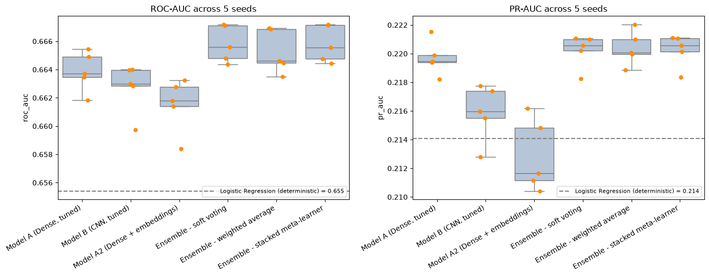

***Figure 12 — Per-seed spread. Note the axis range: every model in the study lives inside a 0.010 ROC-AUC band, and the logistic regression line sits just below it.***

The axis range in Figure 12 repays attention: the whole vertical extent covers about 0.010 ROC-AUC. Architecture choice, embeddings, tuning and ensembling together move the result by less than the span of a plot that had to be zoomed in before anything was visible.

Statistical comparisons use the paired Wilcoxon signed-rank test over the five seeds, with paired Cohen's *d* as the effect size:

| Comparison | Metric | Mean difference | Wilcoxon *W* | *p* | Cohen's *d* |
|---|---|---|---|---|---|
| Ensemble (weighted avg) vs Model A | PR-AUC | **+0.0007** | 0.0 | **0.0625** | **2.73** |
| Ensemble (weighted avg) vs Model A | Minority F1 | +0.00003 | 7.0 | 1.0000 | 0.01 |
| Model A vs Model B | ROC-AUC | +0.0012 | 3.0 | 0.3125 | 0.68 |
| Model A vs Model B | PR-AUC | +0.0038 | 0.0 | **0.0625** | **2.21** |

The *p*-values here need care, for an arithmetic reason. With five paired samples, the smallest two-sided *p*-value the Wilcoxon signed-rank test can produce is 0.0625 — it is attained when one model wins on all five pairs, and it is still above 0.05. No result in this study can reach conventional significance, and none is claimed to. What can be said of the ensemble is that it won on all five seeds with a large effect size, d = 2.73, and that 0.0625 is the floor at this sample size. Claiming significance would repeat the kind of overreach identified in the published work reviewed in Section 2.

Read that way, the comparisons say:

- **The ensemble's PR-AUC advantage is consistent but tiny.** Five wins from five, large effect, and the magnitude is +0.0007.
- **The ensemble gains nothing at all on minority F1**, at +0.00003, *W* = 7.0, *p* = 1.0, *d* = 0.01.
- **The two required architectures are not distinguishable on ROC-AUC** (*p* = 0.3125, *d* = 0.68). Model A wins PR-AUC on all five seeds, but Model B has the better minority F1 (0.2781 vs 0.2751). Neither architecture dominates, which is the direct answer to the locality-prior question posed in Section 2.2.4.
- **Deep learning barely beats logistic regression.** Model A's PR-AUC exceeds the linear baseline on 5 of 5 seeds, but by 0.0056. Model B beats it on 4 of 5; Model A2 on only 2 of 5. A linear model sits inside the confidence band of a tuned deep network.

### 6.5 The ensemble, and a direct test of its premise

The case for ensembling rests on a premise: that different model representations occupy different regions of the solution space, so combining them recovers errors neither makes alone. Three variants were built, each fitted on validation and never on test: soft voting at equal weight, a weighted average with the weight on Model A chosen on validation, and a stacked logistic meta-learner.

Before reporting the gain, we tested the premise. If the two models' predictions are nearly identical, there is nothing for an ensemble to recover, and the size of the gain is predictable in advance:

```text
Pearson r (raw probabilities): 0.9342
Spearman rho (raw probabilities): 0.9077
Disagreement rate (thresholded): 0.0807 (1,604 / 19,867 test rows)

Contingency of hard predictions vs ground truth:
 Both correct: 13,976 (70.35%)
 Both wrong: 4,287 (21.58%)
 Only A correct: 969 (4.88%)
 Only B correct: 635 (3.20%)
```

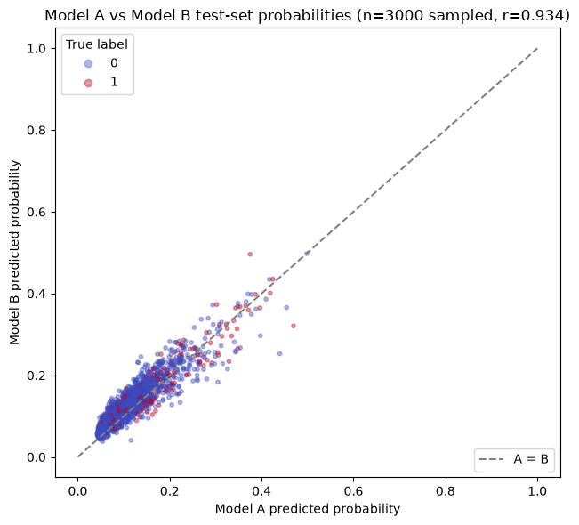

***Figure 13 — Model A against Model B predicted probabilities, seed 42. r = 0.934.***

The premise is empirically false on this data. The two architectures agree on 92% of cases and correlate at r = 0.934, stable across all five seeds (0.934–0.941). The pool available for an ensemble to arbitrate is the 8.07% they disagree on, and separately, 4,287 rows (21.58% of the test set) are cases *both* get wrong, where no combination rule can help. That leaves 1,604 arbitrable rows, and the ensemble must avoid breaking the ones already correct.

That is why the headroom is only +0.0007. The validation-selected weight lands at a mean of 0.82 on Model A against 0.18 on Model B — the ensemble is itself saying Model B contributes little, and all three variants finish within 0.0002 PR-AUC of each other, which is what near-duplicate members produce: the combination rule cannot matter if there is nothing to combine. *(r rose from 0.897 before the `A1Cresult` / `max_glu_serum` correction to 0.934 after it; correcting the features made the two architectures converge further.)*

### 6.6 Interpretability

Deep models are routinely criticised as difficult to interpret, which is a fair objection for anything intended for clinical use. SHAP DeepExplainer was applied to the best individual model, using 100 background samples over 750 explained rows, giving each feature a mean absolute contribution to the model's output.

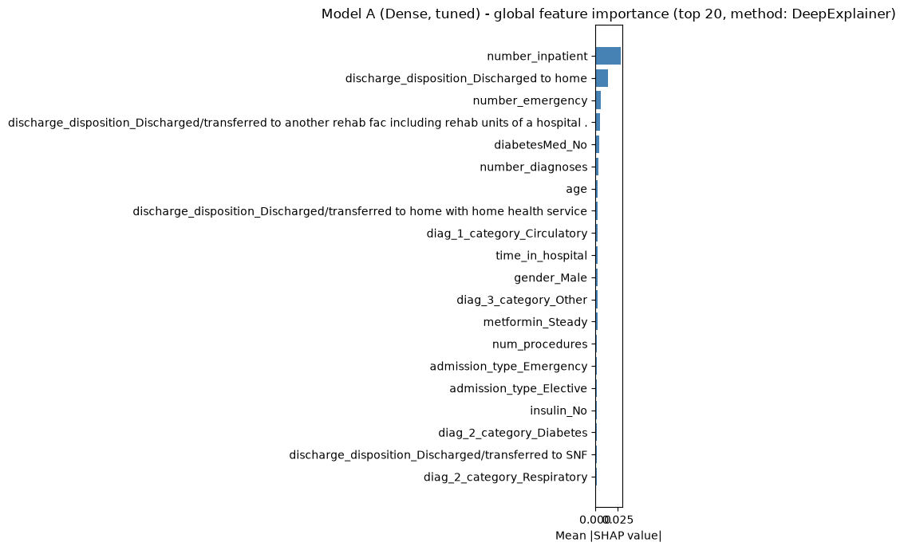

***Figure 14 — Top ten features by mean absolute SHAP value.***

| Rank | Feature | Mean absolute SHAP value |
|---|---|---|
| 1 | `number_inpatient` | **0.0285** |
| 2 | `discharge_disposition_Discharged to home` | 0.0136 |
| 3 | `number_emergency` | 0.0059 |
| 4 | `discharge_disposition_…transferred to another rehab facility` | 0.0056 |
| 5 | `diabetesMed_No` | 0.0048 |
| 6 | `number_diagnoses` | 0.0036 |
| 7 | `age` | 0.0030 |
| 8 | `discharge_disposition_…home with home health service` | 0.0026 |
| 9 | `diag_1_category_Circulatory` | 0.0025 |
| 10 | `time_in_hospital` | 0.0025 |

Three points emerge.

The model is clinically plausible. Prior inpatient utilisation dominates the next feature by a factor of two; discharge disposition occupies three of the top ten; prior emergency visits, comorbidity count and age follow. A patient admitted repeatedly, discharged home without support and carrying many diagnoses is a higher readmission risk, a coherent clinical story, not a set of spurious correlations.

It independently reproduces the literature. Bhuvan et al. (2016) identified number of inpatient visits, discharge disposition and admission type as the dominant predictors on this dataset; nine years later a different model class, split protocol and attribution method return the same answer, as do Emi-Johnson and Nkrumah (2025) and Salim and Ibrahim (2026) via their own SHAP analyses. It also confirms the earlier finding that `number_inpatient` was the only numeric variable whose boxplot shifted between classes.

A negative result about the dataset's own headline variable. Section 3.3.1 corrected the encoding of `A1Cresult` and `max_glu_serum` and restored *"Not tested"* as an explicit category — the variable Strack et al. (2014) built this dataset to study. We expected it to gain importance. It did not: neither column appears in the top ten. Even correctly encoded, whether HbA1c was tested is not a strong predictor of 30-day readmission in this cohort, a finding about the originating paper's variable arrived at properly rather than an artefact of a broken imputation, and consistent with Strack et al.'s own small, diagnosis-conditional association (9.4% vs 8.7%). Mingle's (2017) title, *"Moving beyond HbA1c"*, is the field's verdict; this is one more vote for it.

### 6.7 The best predictive model

Selection was made on mean validation PR-AUC across the five seeds. The test partition is reported, never ranked on.

> **Best model: Ensemble — weighted average.**
> Validation PR-AUC 0.2173 · Test PR-AUC **0.2204 ± 0.0015** · Test ROC-AUC **0.6653 ± 0.0019** · Test minority F1 **0.2751 ± 0.0032**, at a validation-selected threshold.
> Runner-up: Model A (Dense, tuned), validation PR-AUC 0.2169 — a **gap of 0.0005**.

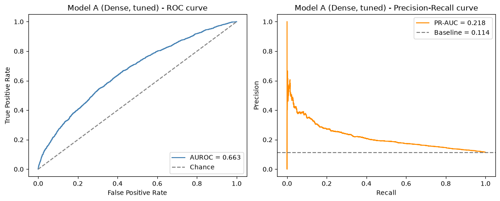

***Figure 15 — ROC and PR curves for the selected model. The PR baseline is the 0.114 positive rate, not 0.5.***

The selection is procedurally correct and substantively close to arbitrary. The winner beats the runner-up by 0.0005 validation PR-AUC, roughly a third of the test-set confidence-interval half-width for that metric. Had the seeds fallen differently, Model A would have won. The defensible claim is not "the weighted-average ensemble is the best architecture for this problem"; it is *"under a pre-declared selection rule applied to validation data, this is the model that was chosen, and it is statistically indistinguishable from three others."* Reporting the margin is what keeps the claim accurate.

### 6.8 Critical analysis

Three limitations. *n = 5 cannot reach conventional significance* — 0.0625 is the floor, and twelve or more seeds would let the ensemble's consistent win clear *p* < 0.05, which given d = 2.73 it very likely would; that is the cheapest available improvement to the study's rigour. *Nothing here evaluates calibration* — every metric used is a ranking or threshold metric, so whether a predicted 0.12 corresponds to a genuine 12% risk is untested, which is what a clinician acting on the output needs (Salim and Ibrahim report a Brier score of 0.094; we do not). *One test set, one split*, all results are conditional on a single grouped partition, where nested cross-validation would remove the dependence on which patients happened to land in the test fold.

What the evaluation established overall. The signal is real but small, and almost entirely captured by prior-utilisation and discharge-disposition variables a logistic regression can also read — while the single decision about *where to put the threshold* moves the operationally relevant metric by 0.27. Section 7 places that result against the published literature.

---

## 7. Conclusion and Comparative Analysis

### 7.1 Introduction

This section places the project's results against the peer work reviewed in Section 2, states what may and may not legitimately be compared, and proposes how the results could be improved. The comparison is structured around the argument the whole report has been building: a published number on this dataset is meaningless without its split protocol and its resampling placement, so those two columns travel with every row.

### 7.2 Method — how the comparison is made, and three traps avoided

Three comparisons that look natural are in fact invalid.

1. Our minority-class F1 must not be compared to Liu et al.'s 0.79. Their F1, precision, recall and accuracy columns are class-averaged and majority-dominated, not minority-class values. Their own Naïve Bayes row proves it: F1 0.03 with accuracy 0.12 and precision 0.82, precision cannot exceed accuracy by that margin unless it is being averaged across classes. Their AUROC column is the trustworthy one. The correct comparators for a minority-class F1 are the only three trustworthy published values, all in the range 0.27–0.30 (Mingle, 2017; Salim & Ibrahim, 2026).

2. Hai et al.'s 0.79 is not a result on this dataset. It comes from a Temple University Health System cohort of 36,641 patients across 2,836,569 encounters, with a 24.9% readmission rate, more than double ours, and an LSTM given up to 80 prior encounters per patient, a cohort mean of 21, and a full longitudinal laboratory panel. Our dataset supplies a mean of 1.42 encounters per patient. Their number is *"what sequence models achieve given history we do not have"*, and it belongs in an other-cohorts row, never as a target.

3. We do not claim to have built the only or the first CNN on this dataset. Two published convolutional results exist — Hammoudeh et al. (2018) at ~0.95 and Tavakolian et al. (2023) at 97.2% accuracy. Both fall in the high-scoring cluster, and Hammoudeh's paper documents SMOTE in its data-engineering section with the split introduced afterwards. The narrower, defensible claim is that both come from pipelines with the resampling placement identified in Section 2.3.1, and ours does not.

### 7.3 Results — the comparative analysis

The full study-by-study table is Section 2.3.2; this is the subset our result must be read against, ordered by ROC-AUC.

| Study | Model | Split protocol | Resampling placement | ROC-AUC | PR-AUC | Minority F1 |
|---|---|---|---|---|---|---|
| Mingle (2017) | **LACE index** *(deployed clinically)* | 10-fold CV | — | **0.56** | — | — |
| Emi-Johnson and Nkrumah (2025) | Deep Neural Network | 80/20 stratified, **not grouped** | class weights, after split | 0.579 | — | — |
| Liu et al. (2024) | MLP / LSTM | patient-grouped 5-fold | SMOTE, training fold only | 0.58 / 0.61 | — | *(class-averaged)* |
| Bhuvan et al. (2016) | Neural net (MLP) | random 75/25 | **none** | — | 0.233 | — |
| Mingle (2017) | Ensemble, ages [70–100) / [30–70) | 10-fold CV | balanced classifiers | 0.65 / 0.70 | — | 0.2694 / 0.3001 |
| Shang et al. (2021) | Random Forest | random 80/20 | training set only, after split | 0.661 | — | — |
| Salim and Ibrahim (2026) | XGBoost (calibrated) / stacking | nested 5×3 CV, **not grouped** | none (cost-sensitive) | 0.664 / 0.665 | **0.215** | **0.27** |
| Emi-Johnson and Nkrumah (2025) | XGBoost | 80/20 stratified, not grouped | class weights, after split | 0.667 | — | — |
| **THIS PROJECT** | **Ensemble — weighted average** | **patient-grouped, 3-way** | **none** (threshold instead) | **0.665 ± 0.002** | **0.220 ± 0.002** | **0.275 ± 0.003** |
| Hammoudeh et al. (2018) / Goudjerkan & Jayabalan (2019) / Sarthak et al. (2020) / Tavakolian et al. (2023) | 1-D CNN, MLP, embedding DNN, GAOCNN | various | **before the split** | ~0.95 – 0.974 | — | not usable |
| *Other cohorts* — Rajkomar et al. (2018) / Hai et al. (2022) | LSTM ensembles over full longitudinal records | held-out / patient-grouped | — | 0.75–0.79 | — | — |
| Kansagara et al. (2011) | Systematic review, 26 models | various | — | c 0.55–0.83 | — | — |

Where this project lands.

- **Above the published neural-network range**, which is 0.58–0.61 (Liu et al.'s MLP 0.58 and LSTM 0.61; Emi-Johnson and Nkrumah's DNN 0.579). Our 0.665 exceeds all three under a stricter protocol than any of them — Emi-Johnson and Nkrumah did not group by patient, and Liu et al. grouped but still applied SMOTE.
- **Above the deployed clinical score.** LACE reaches 0.56 on this data, so our result is 0.105 ROC-AUC above the tool currently in service — the comparison that matters operationally.
- **Inside the gradient-boosting band and level with the best published model.** Our 0.665 sits beside Salim and Ibrahim's stacking ensemble at 0.665 and XGBoost at 0.664, and above Shang et al.'s Random Forest at 0.661, with the difference that we enforced the patient grouping those authors named as their own studies' limitation.
- **PR-AUC and minority F1 both land in the trustworthy band**: 0.220 against Salim and Ibrahim's 0.215 and Bhuvan et al.'s 0.233, and 0.275 inside the 0.27–0.30 range established independently by Mingle (2017) and Salim and Ibrahim (2026) nine years apart.
- **Every study reporting 0.95 or above used a pipeline with the resampling placement measured in Section 4.4.** Our own controlled experiment produced 0.9554 from the same data and architecture by making that one change, so the published cluster is accounted for without attributing modelling skill to it.

Against a 0.56 floor and a ceiling near 0.70, a result of 0.665 is what a good outcome on this dataset looks like.

### 7.4 How the results may be improved

The six improvements below are ordered by the stage of the modelling process they act on, and each is grounded in something this project measured rather than in general advice.

1. Model selection — try gradient boosting. The literature's best carefully evaluated results (0.63–0.70) are all tree-based, our deep models beat logistic regression by only 0.0056 PR-AUC, and Grinsztajn et al. (2022) explain why: neural networks are biased toward overly smooth solutions and are harmed by uninformative features, of which this dataset has many. XGBoost under our grouped protocol is the highest-expected-value next experiment, a recommendation made despite it pointing away from the architecture family used here.

2. Parameter learning — calibration, not just ranking. Nothing here tests whether a predicted 0.12 corresponds to a genuine 12% risk, which is what a clinician acting on the output needs. Isotonic or Platt calibration on the validation partition, evaluated by Brier score and a reliability diagram, would close the one methodological gap Salim and Ibrahim (2026) covered and we did not.

3. Feature engineering — this is where the ceiling actually is. Tuning bought +0.0008, thresholding bought +0.270, and SHAP found the entire signal concentrated in prior-utilisation and discharge-disposition variables: the constraint is the representation, not the estimator. Two routes follow — richer clinical signal (vitals, laboratory trajectories, medication timing, and the post-discharge factors Kansagara et al. (2011) identify as decisive but absent from every inpatient record), and longitudinal structure (Hai et al. reach 0.79 with a mean of 21 prior encounters; Rajkomar et al. reach 0.75–0.76 with the entire raw EHR). The ~0.10 gap between our 0.665 and their 0.75 is the measurable price of a single-encounter administrative record.

4. Hyperparameter selection, a different objective, over more seeds. Section 5 showed 300 trials converging within 0.004 on a `val_auc` objective structurally indifferent to minority-class performance, with single-seed trials ranking differences smaller than their own noise. Searching validation PR-AUC with three or more seeds averaged per trial would rank configurations on the quantity that matters, and on a signal larger than the noise.

5. Finding the variable model parameters — architectural diversity for the ensemble. Section 6.5 measured r = 0.934 between our two models and traced the +0.0007 gain directly to it. An ensemble needs decorrelated members, and a Dense network and a Conv1D network over identical tabular features are not. Pairing a neural network with a gradient-boosted tree, a different inductive bias rather than a rearrangement of the same one, is the version of this idea that would pay.

6. Model evaluation, more seeds, and a resampled split. Twelve or more seeds would let the ensemble's five-from-five win clear *p* < 0.05, which given d = 2.73 it very likely would. And since every result here is conditional on one grouped partition, repeating the pipeline under grouped nested cross-validation would remove the dependence on which patients landed in the test fold — the extension Salim and Ibrahim explicitly recommended.

### 7.5 Critical analysis and conclusion

What was found. Under a patient-grouped split with every fitted transformation confined to the training partition, a weighted-average ensemble of a Dense DNN and a 1-D CNN reaches ROC-AUC 0.665 ± 0.002, PR-AUC 0.220 ± 0.002 and minority-class F1 0.275 ± 0.003. That is above the published neural-network range on this dataset, above the clinical score currently deployed, and level with the best carefully evaluated model in the literature.

What was found that matters more. This project reproduced the literature's upper cluster from its lower one by changing a single line's position: resampling the whole pool before splitting, rather than inside the training fold, took the same architecture on the same data from 0.5806 to 0.9554. Section 4.4 decomposes that +0.3748 into two errors rather than one — leakage and an evaluation-population artefact — whose relative share is metric-dependent, so no single-cause explanation of the 0.95+ cluster is adequate. The decomposition held to three decimal places across a change to the input features, evidence it is a property of the methodology rather than of our preprocessing.

The negative results are substantive rather than incidental. Tuning cost both models minority F1 and cost Model B ROC-AUC as well. Learned ICD-9 embeddings changed nothing measurable. The two required architectures are statistically indistinguishable on ROC-AUC, the convolutional one carrying 6.4× the parameters to achieve it. The ensemble won on all five seeds with a large effect size but gained +0.0007 PR-AUC and nothing on minority F1, for the reason Section 6.5 gives: the two members correlate at r = 0.934, which makes the premise of ensembling false here. Logistic regression sits 0.0056 PR-AUC below a tuned deep network. Together these say what a single strong positive could not: on this data the estimator is not the binding constraint. Against them, the one intervention that worked is instructive — moving the threshold to a validation-selected 0.122 gained +0.270 minority F1 while leaving ROC-AUC and PR-AUC untouched, proving the ranking signal was there all along.

Limitations, stated plainly. Five seeds cannot reach conventional significance and no result here is claimed to. Calibration is untested. All results rest on a single grouped partition rather than nested cross-validation. Tuning searched width but not depth. And the dataset is the largest limitation of all — administrative billing records from 1999–2008, one row per encounter, no post-discharge information, and a mean of 1.42 encounters per patient.

The objective set out in Section 1 was to match or beat the published baselines under a sound protocol rather than to maximise a number, and it was met on every metric for which a trustworthy comparator exists. The more useful outcome is the measurement that made the comparison possible: a controlled demonstration of why a twofold spread exists in the published results for a single public dataset, separated into two distinct measurement errors whose relative contributions depend on which metric is reported. On a problem with a ceiling near 0.70, knowing which published numbers to believe matters more than another thousandth of an AUROC.

---

## References

Bhuvan, M. S., Kumar, A., Zafar, A., & Kishore, V. (2016). *Identifying diabetic patients with high risk of readmission*. arXiv. https://arxiv.org/abs/1602.04257

Chawla, N. V., Bowyer, K. W., Hall, L. O., & Kegelmeyer, W. P. (2002). SMOTE: Synthetic minority over-sampling technique. *Journal of Artificial Intelligence Research, 16*, 321–357. https://doi.org/10.1613/jair.953

Choi, E., Bahadori, M. T., Song, L., Stewart, W. F., & Sun, J. (2017). GRAM: Graph-based attention model for healthcare representation learning. In *Proceedings of the 23rd ACM SIGKDD International Conference on Knowledge Discovery and Data Mining*. Association for Computing Machinery. https://doi.org/10.1145/3097983.3098126

Chopra, C., Sinha, S., Jaroli, S., Shukla, A., & Maheshwari, S. (2017). Recurrent neural networks with non-sequential data to predict hospital readmission of diabetic patients. In *Proceedings of the 2017 International Conference on Computational Biology and Bioinformatics* (pp. 18–23). Association for Computing Machinery. https://doi.org/10.1145/3155077.3155081

Clore, J., Cios, K., DeShazo, J., & Strack, B. (2014). *Diabetes 130-US hospitals for years 1999–2008* [Data set]. UCI Machine Learning Repository. https://doi.org/10.24432/C5230J

Emi-Johnson, O. G., & Nkrumah, K. J. (2025). Predicting 30-day hospital readmission in patients with diabetes using machine learning on electronic health record data. *Cureus, 17*(4), Article e82437. https://doi.org/10.7759/cureus.82437

Futoma, J., Morris, J., & Lucas, J. (2015). A comparison of models for predicting early hospital readmissions. *Journal of Biomedical Informatics, 56*, 229–238. https://doi.org/10.1016/j.jbi.2015.05.016

Goudjerkan, T., & Jayabalan, M. (2019). Predicting 30-day hospital readmission for diabetes patients using multilayer perceptron. *International Journal of Advanced Computer Science and Applications, 10*(2), 268–275. https://doi.org/10.14569/IJACSA.2019.0100236

Grinsztajn, L., Oyallon, E., & Varoquaux, G. (2022). Why do tree-based models still outperform deep learning on typical tabular data? In *Advances in neural information processing systems 35: Datasets and benchmarks track*. https://arxiv.org/abs/2207.08815

Guo, C., & Berkhahn, F. (2016). *Entity embeddings of categorical variables*. arXiv. https://arxiv.org/abs/1604.06737

Hai, A. A., Weiner, M. G., Paranjape, A., Livshits, A., Brown, J. R., Obradovic, Z., & Rubin, D. J. (2022). Deep learning vs traditional models for predicting hospital readmission among patients with diabetes. *AMIA Annual Symposium Proceedings, 2022*, 512–521.

Hammoudeh, A., Al-Naymat, G., Ghannam, I., & Obied, N. (2018). Predicting hospital readmission among diabetics using deep learning. *Procedia Computer Science, 141*, 484–489. https://doi.org/10.1016/j.procs.2018.10.138

Kansagara, D., Englander, H., Salanitro, A., Kagen, D., Theobald, C., Freeman, M., & Kripalani, S. (2011). Risk prediction models for hospital readmission: A systematic review. *JAMA, 306*(15), 1688–1698. https://doi.org/10.1001/jama.2011.1515

Kapoor, S., & Narayanan, A. (2023). Leakage and the reproducibility crisis in machine-learning-based science. *Patterns, 4*(9), Article 100804. https://doi.org/10.1016/j.patter.2023.100804

Liu, V. B., Sue, L. Y., & Wu, Y. (2024). Comparison of machine learning models for predicting 30-day readmission rates for patients with diabetes. *Journal of Medical Artificial Intelligence, 7*, Article 23. https://doi.org/10.21037/jmai-24-70

Mingle, D. (2017). Predicting diabetic readmission rates: Moving beyond HbA1c. *Current Trends in Biomedical Engineering & Biosciences, 7*(3), 55–65. https://doi.org/10.19080/CTBEB.2017.07.555715

Miotto, R., Li, L., Kidd, B. A., & Dudley, J. T. (2016). Deep Patient: An unsupervised representation to predict the future of patients from the electronic health records. *Scientific Reports, 6*, Article 26094. https://doi.org/10.1038/srep26094

Neto, C., Senra, F., Leite, J., Rei, N., Rodrigues, R., Ferreira, D., & Machado, J. (2021). Different scenarios for the prediction of hospital readmission of diabetic patients. *Journal of Medical Systems, 45*(1), Article 11. https://doi.org/10.1007/s10916-020-01686-4

Pham, H. N., Chatterjee, A., Narasimhan, B., Lee, C. W., Jha, D. K., Wong, E. Y. F., Ellyanti, S., Nguyen, Q. H., Nguyen, B. P., & Chua, M. C. H. (2019). Predicting hospital readmission patterns of diabetic patients using ensemble model and cluster analysis. In *2019 International Conference on System Science and Engineering* (pp. 273–278). IEEE. https://doi.org/10.1109/ICSSE.2019.8823441

Rajkomar, A., Oren, E., Chen, K., Dai, A. M., Hajaj, N., Hardt, M., et al. (2018). Scalable and accurate deep learning with electronic health records. *npj Digital Medicine, 1*, Article 18. https://doi.org/10.1038/s41746-018-0029-1

Saito, T., & Rehmsmeier, M. (2015). The precision-recall plot is more informative than the ROC plot when evaluating binary classifiers on imbalanced datasets. *PLOS ONE, 10*(3), Article e0118432. https://doi.org/10.1371/journal.pone.0118432

Salim, S. S., & Ibrahim, A. A. (2026). A machine learning approach for predicting 30-day hospital readmission in patients with diabetes. *Healthcare, 14*(9), Article 1185. https://doi.org/10.3390/healthcare14091185

Sarthak, Shukla, S., & Tripathi, S. P. (2020). *EmbPred30: Assessing 30-days readmission for diabetic patients using categorical embeddings*. arXiv. https://arxiv.org/abs/2002.11215

Shang, Y., Jiang, K., Wang, L., Zhang, Z., Zhou, S., Liu, Y., Dong, J., & Wu, H. (2021). The 30-days hospital readmission risk in diabetic patients: Predictive modeling with machine learning classifiers. *BMC Medical Informatics and Decision Making, 21*(Suppl. 2), Article 57. https://doi.org/10.1186/s12911-021-01423-y

Shwartz-Ziv, R., & Armon, A. (2022). Tabular data: Deep learning is not all you need. *Information Fusion, 81*, 84–90. https://doi.org/10.1016/j.inffus.2021.11.011

Strack, B., DeShazo, J. P., Gennings, C., Olmo, J. L., Ventura, S., Cios, K. J., & Clore, J. N. (2014). Impact of HbA1c measurement on hospital readmission rates: Analysis of 70,000 clinical database patient records. *BioMed Research International, 2014*, Article 781670. https://doi.org/10.1155/2014/781670

Tavakolian, A., Rezaee, A., Hajati, F., & Uddin, S. (2023). Hospital readmission and length-of-stay prediction using an optimized hybrid deep model. *Future Internet, 15*(9), Article 304. https://doi.org/10.3390/fi15090304

van den Goorbergh, R., van Smeden, M., Timmerman, D., & Van Calster, B. (2022). The harm of class imbalance corrections for risk prediction models: Illustration and simulation using logistic regression. *Journal of the American Medical Informatics Association, 29*(9), 1525–1534. https://doi.org/10.1093/jamia/ocac093

Zarghani, A. (2024). *Comparative analysis of LSTM neural networks and traditional machine learning models for predicting diabetes patient readmission*. arXiv. https://arxiv.org/abs/2406.19980

---

## Appendix A — Reproducibility

| Item | Detail |
|---|---|
| Environment | Python 3.12, TensorFlow 2.21.0, Keras 3.15.0, Keras Tuner 1.4.8, scikit-learn, SHAP; 154 pinned packages in `requirements.txt` |
| Global seed | 42; repeated-seed sweep uses 42, 123, 2024, 7, 31415 |
| Notebooks | `01_eda_and_preprocessing.ipynb` · `02_model_building.ipynb` · `03_hyperparameter_tuning.ipynb` · `04_evaluation_and_ensemble.ipynb`. All executed end to end with outputs retained |
| Saved models | `model_a_dense.keras`, `model_b_cnn.keras`, `model_a2_embeddings.keras`, `model_a_tuned.keras`, `model_b_tuned.keras`, `ensemble_stacking_meta_learner.joblib`, `model_logreg_baseline.joblib` |
| Saved transformers | `preprocessor.joblib`, `variance_selector.joblib`, `diag_encoders.joblib` |
| Result artifacts | `manifest.json`, `results_phase3.json`, `results_phase4.json`, `results_phase5.json`, `experiment_2x2.json` |
| Data | `diabetic_data.csv` (101,766 × 50) and `IDS_mapping.csv`, as distributed by the UCI Machine Learning Repository under CC BY 4.0 |

